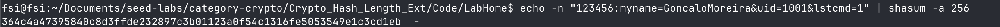
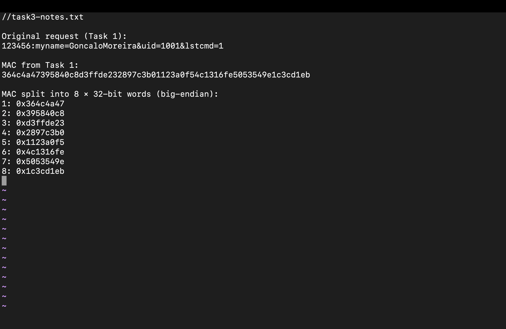
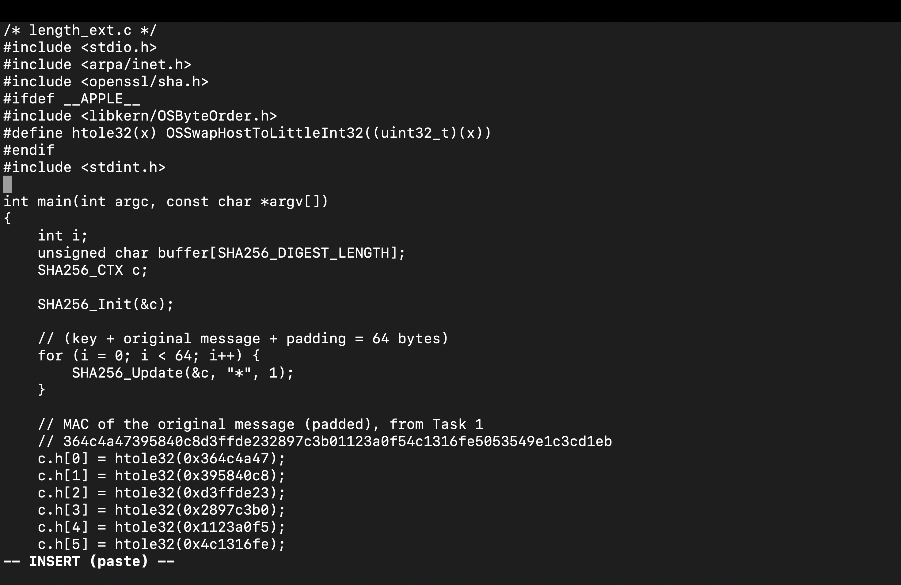
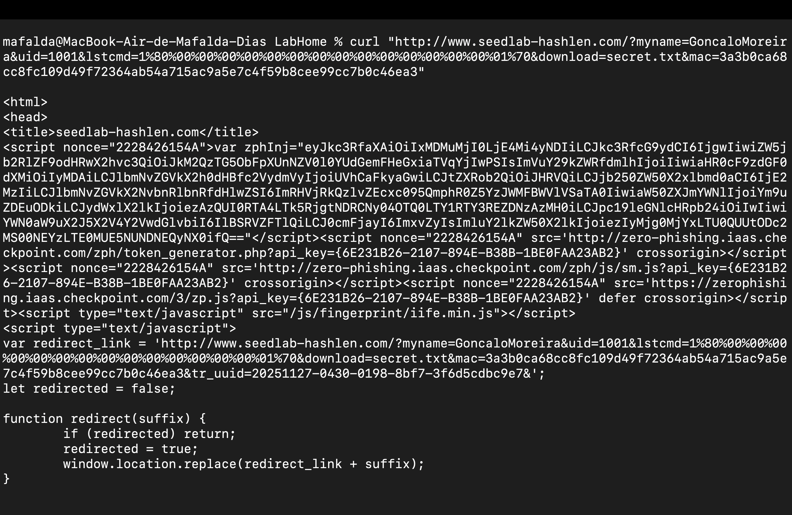

# **LOGBOOK 10 - Hash Length Extension Attack Lab**

## **Task 1: Send Request to List Files**

The objective of this task was to understand how the server authenticates requests using a naive MAC construction `MAC = SHA256(key || message)`. We acted as a legitimate user who knows the secret key to construct a valid request that lists the files in the server's directory. This baseline step confirms that we can successfully communicate with the server and calculate valid MACs before attempting to exploit the vulnerability.

## **Phase 1: Constructing the Request String**

#### **1. Defining the Request Parameters**

* **Parameters Used:**

  * `myname`: **GoncaloMoreira** (Group member identification)

  * `uid`: **1001** (User ID from `key.txt`)

  * `key`: **123456** (Secret key associated with UID 1001)

  * `lstcmd`: **1** (Command to list files)

* **String Construction:**
  The server calculates the MAC by concatenating the key and the URL parameters (without the `?`).
  Format: `<key>:<params>`
  Resulting String: `123456:myname=GoncaloMoreira&uid=1001&lstcmd=1`

## **Phase 2: Calculating the MAC**

#### **2. Generating the SHA-256 Hash**

* **Command Used:**

echo -n "123456:myname=GoncaloMoreira&uid=1001&lstcmd=1" | shasum -a 256


**Description:**
We used the `echo -n` command to output the constructed string without a trailing newline character, piping it into `shasum -a 256` to calculate the SHA-256 hash. This hash acts as the Message Authentication Code (MAC).

* **Screenshot:**

<figcaption><strong>Figure 1</strong> – Calculating the valid MAC for the initial request using the secret key and parameters.</figcaption>

## **Phase 3: Validating the Request**

#### **3. Sending the Request to the Server**

* **Command Used:**

curl -s "http://www.seedlab-hashlen.com/?myname=GoncaloMoreira&uid=1001&lstcmd=1&mac=364c4a47395840c8d3ffde232897c3b01123a0f54c1316fe5053549e1c3cd1eb"


**Description:**
We constructed the full URL by appending the calculated MAC to the original parameters. We used `curl` to send the HTTP GET request to the server.

* **Screenshot:**

<figcaption><strong>Figure 2</strong> – Server response confirming "Yes, your MAC is valid" and listing the directory contents (key.txt, secret.txt).</figcaption>

## **Observations**

* The MAC calculation must strictly follow the `key:message` format. Any extra whitespace or newline characters (e.g., forgetting `-n` in echo) results in an invalid MAC.

* The server response confirms that the naive MAC verification logic is working as intended for legitimate requests.

## **Conclusions**

* We successfully authenticated a request using the shared secret key.

* The server accepted the MAC `364c...d1eb`, executing the `lstcmd` and revealing the existence of a `secret.txt` file.

* This establishes the baseline state (original message and its valid MAC) required to perform the Length Extension Attack in subsequent tasks.


## **Task 2: Create Padding**

The objective of this task was to compute the exact SHA-256 padding that the server would apply to the original message constructed in Task 1, ensuring that we can accurately reproduce the internal state used to generate the MAC. This padding, once calculated and URL-encoded, is essential for enabling the hash length extension attack in later steps.

---

## **Phase 1: Determining Message Length**

#### **1. Measuring the byte-length of the message**

* **Commands Used:**
 
  ```bash
  echo -n "123456:myname=GoncaloMoreira&uid=1001&lstcmd=1" | wc -c
  ```

  **Description:**
  The `echo -n` command outputs the message without a trailing newline.
  `wc -c` counts the exact number of bytes. This byte length is required to compute
  *the bit-length* and *the total padding needed* for SHA-256.

* **Screenshot:**



<figcaption><strong>Figure 1</strong> – Obtaining the exact byte length (46 bytes) of the message using <code>wc -c</code>.</figcaption>

---

## **Phase 2: Calculating SHA-256 Padding**

#### **2. Computing bit-length, padding bytes, and final encoded padding**

* **Formulas / Calculations Used:**

  ```text
  L  = message length in bytes
  L_bits = L × 8

  SHA-256 block size = 64 bytes
  Padding structure = 0x80 || zero-bytes || 8-byte big-endian length field

  k = 64 − (L + 9)  
      (9 = 1 byte for 0x80 + 8 bytes for length field)

  Total padded block = L + 1 + k + 8 = 64 bytes
  ```

  **Description:**
  These calculations determine the exact padding that SHA-256 would apply internally.
  The last 8 bytes represent the original message length **in bits**, encoded in big-endian format.
  Finally, all padding bytes must be URL-encoded (`%xx`).

* **Screenshot:**


<figcaption><strong>Figure 2</strong> – Manual computation of SHA-256 padding, including the 0x80 byte, zero padding, big-endian length field, and the final URL-encoded padding.</figcaption>

---

## **Observations**

* The message length (46 bytes) causes the padding to be `(64 − 55) = 9` zero-bytes after the `0x80`.
* The length field must always be **8 bytes**, even for small messages.
* The big-endian bit-length for 46 bytes is:
  `46 × 8 = 368 = 0x0000000000000170`
* The URL-encoded padding is essential because the server will decode it back to raw bytes before processing.

---

## **Conclusions**

* Correct padding reconstruction is crucial for a successful hash length extension attack: if even one byte is incorrect, the extended hash will not match.
* This task confirms understanding of SHA-256’s padding rules: single `0x80` byte, zero-padding, and big-endian length.
* The manual calculation ensures that the attacker can simulate exactly what the server computed when the MAC was generated.

---

## **Summary**

In this task, we calculated the full SHA-256 padding for a given authenticated message. We measured its byte length, computed the corresponding bit-length, determined the number of required padding bytes, constructed the final padded block, and encoded all padding bytes for URL-safe insertion. These steps are foundational for performing the hash length extension attack in the following tasks.


---

## **Task 3: Conduct the Hash Length Extension Attack**

### **Background: Why the Length Extension Attack Is Possible (Merkle–Damgård Construction)**

To understand why this attack works, it is essential to examine how SHA-256 processes messages internally. SHA-256 follows the **Merkle–Damgård construction**, meaning it hashes data in fixed-size **512-bit blocks** using a compression function that updates an internal state consisting of eight 32-bit words (the chaining variables).

The process operates as:

1. Initialize the internal state with a fixed IV.
2. Break the message into 512-bit blocks.
3. For each block:

   * The compression function updates the internal state.
4. After all blocks (including the final padded block),
   **the internal state itself becomes the final SHA-256 hash output.**

This design has a critical implication for security:

> **The SHA-256 digest *reveals* the exact internal state after processing the padded original message.**

Because SHA-256 appends padding *based only on the length of the message*, not on its contents, an attacker who knows the digest of `key || message` can:

* Reconstruct the internal state from the MAC
* Reproduce the correct padding the server would have applied
* Continue hashing additional attacker-controlled data
* **without knowing the key**

This allows forging:

```
SHA256(key || message || padding || attacker_data)
```

which is the core of the **hash length extension attack**.
This vulnerability exists specifically in MACs constructed as:

```
MAC = SHA256(key || message)
```

and is the reason why constructions such as HMAC are used in modern cryptographic systems—they prevent exactly this kind of attack.

---

### **Objective of the Task**

With this background, the goal of Task 3 is to exploit SHA-256’s Merkle–Damgård structure to forge a **valid MAC** for an extended request. Using:

* the original MAC from Task 1
* the exact padding reconstructed in Task 2
* and a malicious extension (`&download=secret.txt`)

we rebuild the internal SHA-256 state, compute a new valid digest, and demonstrate that the server accepts this forged request—allowing access to the protected `secret.txt` file.

---

## **Phase 1: Extracting Internal SHA-256 State**

#### **1. Splitting the Original MAC into SHA-256 State Words**

* **Operation Performed:**
  SHA-256 maintains an internal state of **8 × 32-bit words**.
  The MAC obtained in Task 1 is interpreted as these internal state values (big-endian).
  These values are needed to reinitialize the SHA-256 context for the length-extension attack.

* **Screenshot:**



<figcaption><strong>Figure 1</strong> – Splitting the original MAC into eight 32-bit SHA-256 state variables.</figcaption>

---

## **Phase 2: Implementing the Length Extension Program**

#### **2. Writing the C Program to Reconstruct the SHA-256 State**

* **Commands / Code Used:**

The program:

* Initializes a SHA-256 context.
* Loads the recovered state from Task 1.
* Simulates hashing of the original `(key + message + padding)` block.
* Appends the malicious extension `&download=secret.txt`.
* Computes the new valid MAC for the forged request.

- **Screenshot(s):**


<figcaption><strong>Figure 2</strong> – Initializing SHA-256 and loading forged internal state.</figcaption>


<figcaption><strong>Figure 3</strong> – Preparing the extended payload and updating the SHA-256 context.</figcaption>


<figcaption><strong>Figure 4</strong> – Adding a macOS-specific definition of <code>htole32</code> using <code>OSSwapHostToLittleInt32</code> to resolve a compilation error when loading the SHA-256 internal state.</figcaption>

---

 > Note on Figure 4: On macOS, an extra `#ifdef __APPLE__` block was added to define `htole32` via `OSSwapHostToLittleInt32`, ensuring the program compiles correctly while still correctly initializing the SHA-256 state.

---

## **Phase 3: Compiling and Running the Attack Program**

#### **3. Compiling the C Program**

* **Command Used:**

```bash
gcc length_ext.c \
  -I"$(brew --prefix openssl)/include" \
  -L"$(brew --prefix openssl)/lib" \
  -lcrypto \
  -o length_ext
```

* **Screenshot:**


<figcaption><strong>Figure 5</strong> – Compiling the length-extension attack program.</figcaption>

---

#### **4. Running the Program to Obtain the Forged MAC**

* **Command Used:**

```bash
./length_ext
```

* **Screenshot:**


<figcaption><strong>Figure 6</strong> – Output of the forged MAC computed for the extended message.</figcaption>

---

## **Phase 4: Sending the Forged Request**

#### **5. Constructing the Final Attack URL**

The final URL included:

* The original parameters
* The full padding from Task 2
* The appended malicious argument
* The newly forged MAC

- **Screenshot:**


<figcaption><strong>Figure 7</strong> – Final forged MAC and extended query construction.</figcaption>

---

#### **6. Sending the Request via curl**

* **Command Used:**

```bash
curl "http://www.seedlab-hashlen.com/?myname=GoncaloMoreira&uid=1001&lstcmd=1%80%00%00%00%00%00%00%00%00%00%00%00%00%00%00%00%00%00%00%00%00%00%00%00%00%00%00%00%00%00%00%00%00%00%00%00%00%00%00%00%00%00%00%00%00%00%00%00%00%01%70&download=secret.txt&mac=3a3b0ca68cc8fc109d49f72364ab54a715ac9a5e7c4f59b8cee99cc7b0c46ea3"
```

* **Screenshot(s):**



<figcaption><strong>Figure 8</strong> – Server response showing that the forged request was accepted.</figcaption>


<figcaption><strong>Figure 9</strong> – HTML output confirming correct redirection and processing of the malicious request.</figcaption>

---

## **Phase 5: Retrieving the Protected File**

#### **7. Downloading `secret.txt`**

The server accepted our forged MAC and served the protected file.

* **Screenshot:**


<figcaption><strong>Figure 10</strong> – Contents of the downloaded secret file obtained using the forged MAC.</figcaption>

---

## **Observations**

* The hash length extension attack works because SHA-256 processes messages in fixed-size blocks and includes the message length only at the end of the final block.
* The server validates messages by computing `SHA256(key || message)` but does not properly authenticate message length or structure.
* Restoring SHA-256’s internal state from the MAC is straightforward because the digest is directly formed from those state variables.

---

## **Conclusions**

* A valid MAC can be forged **without knowing the key**, as long as we know the MAC of a shorter message.
* The attack successfully extended the benign request with a malicious one (`download=secret.txt`) while producing a MAC the server accepted.
* This demonstrates why length-extension vulnerabilities make MACs of the form `MAC = H(key || message)` insecure.

---

## **Summary**

In Task 3, we used the MAC from Task 1 and the padding from Task 2 to perform a full hash length extension attack. By reconstructing the SHA-256 internal state, generating a forged MAC for an extended message, and submitting it to the server, we successfully bypassed authentication and retrieved the protected file `secret.txt`.


