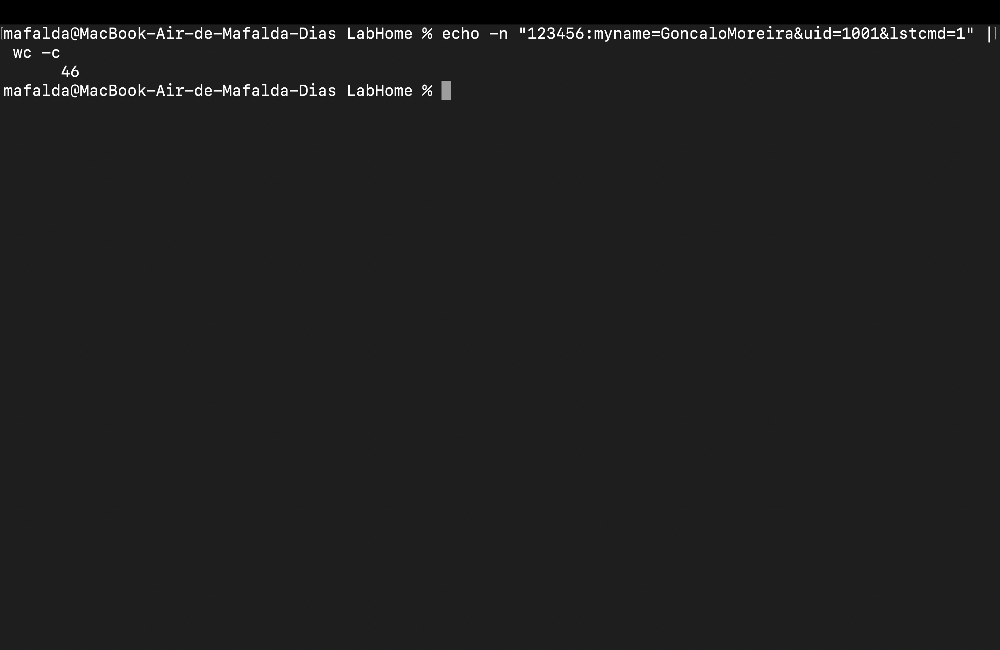
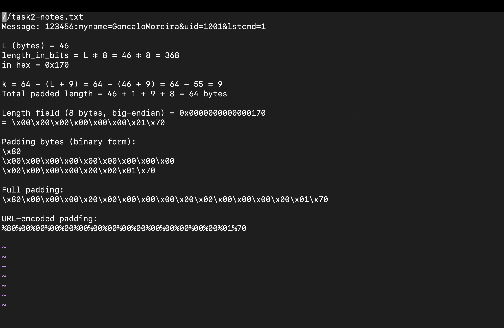

# **LOGBOOK 10 - Hash Length Extension Attack Lab**

## **Task 2: Create Padding**

The objective of this task was to compute the exact SHA-256 padding that the server would apply to the original message constructed in Task 1, ensuring that we can accurately reproduce the internal state used to generate the MAC. This padding, once calculated and URL-encoded, is essential for enabling the hash length extension attack in later steps.

---

## **Phase 1: Determining Message Length**

#### **1. Measuring the byte-length of the message**

* **Commands Used:**

  ```bash
  echo -n "123456:myname=GoncaloMoreira&uid=1001&lstcmd=1" | wc -c
  ```

  **Description:**
  The `echo -n` command outputs the message without a trailing newline.
  `wc -c` counts the exact number of bytes. This byte length is required to compute
  *the bit-length* and *the total padding needed* for SHA-256.

* **Screenshot:**



<figcaption><strong>Figure 1</strong> – Obtaining the exact byte length (46 bytes) of the message using <code>wc -c</code>.</figcaption>

---

## **Phase 2: Calculating SHA-256 Padding**

#### **2. Computing bit-length, padding bytes, and final encoded padding**

* **Formulas / Calculations Used:**

  ```text
  L  = message length in bytes
  L_bits = L × 8

  SHA-256 block size = 64 bytes
  Padding structure = 0x80 || zero-bytes || 8-byte big-endian length field

  k = 64 − (L + 9)  
      (9 = 1 byte for 0x80 + 8 bytes for length field)

  Total padded block = L + 1 + k + 8 = 64 bytes
  ```

  **Description:**
  These calculations determine the exact padding that SHA-256 would apply internally.
  The last 8 bytes represent the original message length **in bits**, encoded in big-endian format.
  Finally, all padding bytes must be URL-encoded (`%xx`).

* **Screenshot:**



<figcaption><strong>Figure 2</strong> – Manual computation of SHA-256 padding, including the 0x80 byte, zero padding, big-endian length field, and the final URL-encoded padding.</figcaption>

---

## **Observations**

* The message length (46 bytes) causes the padding to be `(64 − 55) = 9` zero-bytes after the `0x80`.
* The length field must always be **8 bytes**, even for small messages.
* The big-endian bit-length for 46 bytes is:
  `46 × 8 = 368 = 0x0000000000000170`
* The URL-encoded padding is essential because the server will decode it back to raw bytes before processing.

---

## **Conclusions**

* Correct padding reconstruction is crucial for a successful hash length extension attack: if even one byte is incorrect, the extended hash will not match.
* This task confirms understanding of SHA-256’s padding rules: single `0x80` byte, zero-padding, and big-endian length.
* The manual calculation ensures that the attacker can simulate exactly what the server computed when the MAC was generated.

---

## **Summary**

In this task, I calculated the full SHA-256 padding for a given authenticated message. I measured its byte length, computed the corresponding bit-length, determined the number of required padding bytes, constructed the final padded block, and encoded all padding bytes for URL-safe insertion. These steps are foundational for performing the hash length extension attack in the following tasks.

