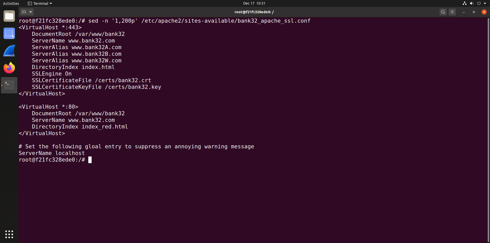

## Task 1 Report — Becoming a Certificate Authority (CA) (OpenSSL)


In a normal PKI setup, you pay or otherwise rely on a commercial Certificate Authority (CA) to vouch for identities by signing certificates. In this lab, we become that trusted entity ourselves by creating a **root CA certificate**. Because it’s a root, it is **self-signed** (it signs its own certificate). Once that’s done, this CA can later sign certificates for servers/users in the other tasks.

> Note: OpenSSL’s CA workflow relies on a configuration file (`openssl.cnf`) and a small CA “database” structure (folders + `index.txt` + `serial`) so OpenSSL can track what it issued.

---

#### 1. Installing / locating OpenSSL + copying the config

We verified OpenSSL was installed via Homebrew and set OpenSSL’s binary path, then located the system `openssl.cnf` and copied it into your working directory so you could edit it locally.

  
  <figcaption><b>Figure 1</b>–Installing/verifying OpenSSL via Homebrew and setting an OpenSSL path variable.</figcaption>

  

<figcaption><b>Figure 2</b>–Locating the Homebrew OpenSSL configuration file and copying <code>openssl.cnf</code> into the working directory.</figcaption>

#### 2 Editing `openssl.cnf` (CA defaults)

We opened the copied `openssl.cnf` in the nano editor, navigated to the CA section, and specifically changed the setting that the lab asked us to change: **allow repeated subjects** by setting:

* `unique_subject = no` (to uncomment)


<figcaption><b>Figure 3</b>–Opening the copied <code>openssl.cnf</code> file using the Pico text editor.</figcaption>


<figcaption><b>Figure 4</b>–Viewing the <code>[ CA_default ]</code> section of <code>openssl.cnf</code> before enabling duplicate-subject certificates.</figcaption>


<figcaption><b>Figure 5</b>–Enabling the <code>unique_subject = no</code> option to allow issuing multiple certificates with the same subject.</figcaption>

#### 3. Creating the CA directory structure (`demoCA`)

Per the lab instructions (and matching the config defaults), we created the expected CA working directory and its subfolders, and initialized the two required files:

* `index.txt` as an empty database index
* `serial` initialized to `1000`


<figcaption><b>Figure 6</b>–Creating the <code>demoCA</code> directory structure and initializing the <code>index.txt</code> and <code>serial</code> files.</figcaption>


#### 4. Generating the root CA key + self-signed certificate

We ran the CA self-signed certificate generation command:

```bash
openssl req -x509 -newkey rsa:4096 -sha256 -days 3650 \
  -keyout ca.key -out ca.crt
```

OpenSSL generated the RSA keypair (4096-bit) and prompted you for:

* a PEM passphrase (to protect `ca.key`)
* subject fields (Country, State, Organization, Common Name, etc.)


<figcaption><b>Figure 7</b>–Generating the self-signed root CA certificate using the <code>openssl req -x509</code> command.</figcaption>


Your entered subject information (as shown) was:

* **C** = PT
* **ST** = Porto
* **L** = Paranhos
* **O** = FEUP
* **OU** = t01-group6
* **CN** = t01-group6 Root CA
* **emailAddress** = [www.modelCA.com](http://www.modelCA.com)


<figcaption><b>Figure 8</b>–Entering the Distinguished Name (DN) information for the root CA certificate.</figcaption>


#### 5. Inspecting the certificate and key (the lab questions come from here)

We ran the two inspection commands the lab requested:

```bash
openssl x509 -in ca.crt -text -noout
openssl rsa  -in ca.key -text -noout
```


<figcaption><b>Figure 9</b>–Decoded output of the CA certificate showing version, serial number, issuer, subject, and validity period.</figcaption>


<figcaption><b>Figure 10</b>–Decoded certificate output displaying the RSA public key modulus and public exponent.</figcaption>


<figcaption><b>Figure 11</b>–X509v3 extensions confirming CA status through <code>Basic Constraints: CA:TRUE</code>.</figcaption>


<figcaption><b>Figure 12</b>–Decoded RSA private key output showing the 4096-bit modulus <code>n</code>.</figcaption>


<figcaption><b>Figure 13</b>–RSA private key output displaying the public exponent <code>e</code> and private exponent <code>d</code>.</figcaption>


<figcaption><b>Figure 14</b>–RSA private key output showing the prime numbers <code>p</code> (prime1) and <code>q</code> (prime2).</figcaption>


<figcaption><b>Figure 15</b>–RSA private key output displaying CRT parameters <code>exponent1</code> and <code>exponent2</code>.</figcaption>


<figcaption><b>Figure 16</b>–RSA private key output showing the CRT coefficient used for optimized decryption.</figcaption>

---

##  Answers to the lab questions (based on your outputs)

### Q1 — What part of the certificate indicates this is a CA’s certificate?

The clearest marker is the **X509v3 Basic Constraints** extension showing:

* `X509v3 Basic Constraints: critical`
* `CA:TRUE`

This appears directly in your decoded certificate output.
(See Figure 11.)

Why this matters: in X.509, **Basic Constraints** is the standard extension that tells verifiers whether the certificate is allowed to act as a CA (i.e., sign other certificates).

---

### Q2 — What part of the certificate indicates this is a self-signed certificate?

You have two strong “tells” in your output:

1. **Issuer equals Subject**
   In the decoded certificate text, the `Issuer:` line and the `Subject:` line contain the same DN values (C=PT, ST=Porto, … CN=to1-group6 Root CA, …).
   (Visible in Figure 9)

2. **Authority Key Identifier matches Subject Key Identifier**
   In your certificate’s extensions, the **Authority Key Identifier** value is the same as the **Subject Key Identifier** value (same hex bytes). That’s exactly what you’d expect when the certificate is signed by itself.
   (Visible in Figure 11)

---

### Q3 — Identify RSA parameters `e`, `d`, `n`, `p`, and `q` from your certificate/key output

Below I’m mapping each RSA parameter to *where it appears* in your outputs, and I’m listing the values in the same colon-hex formatting OpenSSL prints.

#### Public exponent `e`

* Found in: certificate output (Figure 10) and RSA key output (Figure 13)
* Value:

  * `e = 65537 (0x10001)`

#### Modulus `n`

* Found in: certificate output under **Subject Public Key Info → Modulus** (Figures 9–10) and also in the private key output under `modulus:` (Figure 12)
* Value (shown across many wrapped lines in your screenshots):

  * Starts with: `00:c8:15:31:ec:a3:c1:48:f8:79:ab:98:91:3c:65:...`
  * Ends with: `...:3b:bc:31:67:4d:75:2e:d0:d8:03:aa:e3:a2:0b:a5:7b:69:ab`
  * (Full value is printed in Figures 9–10 / Figure 12)

#### Private exponent `d`

* Found in: private key output under `privateExponent:` (Figure 13)
* Value (also wrapped across many lines):

  * Starts with: `07:43:55:b3:9c:62:28:ce:f4:43:b9:5f:14:4d:30:...`
  * Ends with: `...:cd:0c:10:bf:0e:ba:15:84:dc:95:d0:29`
  * (Full value is printed in Figure 13)

#### Prime `p` (prime1)

* Found in: private key output under `prime1:` (Figure 14)
* Value:

  * Starts with: `00:e7:9c:43:ea:f9:3f:d8:6c:12:e9:b0:74:14:f1:...`
  * Ends with: `...:3d:87:8f:11:4a:2f:e5`
  * (Full value is printed in Figure 14)

#### Prime `q` (prime2)

* Found in: private key output under `prime2:` (Figure 14; continues into later output)
* Value:

  * Starts with: `00:dd:27:02:bf:77:01:28:dc:e1:56:db:e3:9e:6e:...`
  * Ends with: `...:13:9f:47:f2:7d:fa:4f`
  * (The start is visible in Figure 14, and the “...fa:4f” ending is visible at the top of Figure 15)

---

## Conclusions

We:

* prepared the CA config (`openssl.cnf`) and enabled duplicate subject issuance (`unique_subject = no`);
* created the CA database structure (`demoCA`, `index.txt`, `serial=1000`);
* generated a 4096-bit RSA private key (`ca.key`) protected by a passphrase;
* generated a **self-signed Root CA certificate** (`ca.crt`);
* verified via decoded output that:

  * it is a CA cert (`Basic Constraints: CA:TRUE`);
  * it is self-signed (`Issuer == Subject`, and SKI == AKI);
  * and you extracted the RSA parameters from the printed modulus/exponents/primes.


---

## Task 2 Report — Generating a Certificate Signing Request (CSR) for a Web Server

In this task, we generate a **Certificate Signing Request (CSR)** for a web server that wishes to obtain a public-key certificate from the Certificate Authority (CA) created in Task 1. A CSR contains the server’s **public key** and **identity information**, and it is later sent to the CA, which verifies the information and issues a signed certificate.

Unlike Task 1, where a **self-signed certificate** was created using the `-x509` option, here we intentionally **omit** that option so that OpenSSL generates a **request**, not a certificate. This CSR will later be signed by our root CA in the next task.

> Note: Modern browsers enforce strict hostname validation rules. Therefore, in addition to the Common Name (CN), the CSR must include a **Subject Alternative Name (SAN)** extension containing all valid hostnames for the server.

---

### 1. Generating the server private key and CSR

We generated a new RSA key pair and a CSR for our web server using the following command:

```bash
openssl req -newkey rsa:2048 -sha256 \
-keyout server.key -out server.csr \
-subj "/CN=www.group06.com/O=FEUP/C=PT" \
-passout pass:dees \
-addext "subjectAltName = DNS:www.group06.com, DNS:www.group06A.com, DNS:www.group06B.com"
```

This command performs the following actions:

* generates a **2048-bit RSA private key**, stored in `server.key` and protected with a passphrase;
* creates a **certificate signing request**, stored in `server.csr`;
* sets the server’s identity information (CN, organization, country);
* adds a **Subject Alternative Name (SAN)** extension containing multiple DNS names.


<figcaption><b>Figure 17</b>–Generating a 2048-bit RSA private key and a Certificate Signing Request (CSR) with Subject Alternative Names.</figcaption>

The Common Name (CN) identifies the primary hostname of the server, while the SAN extension includes additional hostnames that will be accepted by browsers.

---

### 2. Inspecting the generated CSR

After generating the CSR, we inspected its contents to verify that all required information was correctly included:

```bash
openssl req -in server.csr -text -noout
```


<figcaption><b>Figure 18</b>–Decoded CSR output showing the subject information and RSA public key parameters.</figcaption>

From the decoded CSR output, we observe:

* **Subject**:

  ```
  CN=www.group06.com, O=FEUP, C=PT
  ```

  This matches exactly the identity information provided during CSR generation.

* **Public Key Information**:

  * Algorithm: RSA
  * Key size: 2048 bits
  * Public exponent: 65537 (0x10001)


<figcaption><b>Figure 19</b>–CSR extensions showing the Subject Alternative Name (SAN) field.</figcaption>

The CSR also contains the required **X509v3 Subject Alternative Name** extension:

```
DNS:www.group06.com
DNS:www.group06A.com
DNS:www.group06B.com
```

Including the Common Name inside the SAN extension is mandatory; otherwise, modern browsers would reject the certificate even if the CN matches the hostname.

---

## 3. Inspecting the server private key

After generating the CSR, we inspected the server’s private key to verify that the RSA parameters were correctly generated. This was done using the following command:

```bash
openssl rsa -in server.key -text -noout
```

The correct passphrase was entered, allowing OpenSSL to successfully decode the private key.


<figcaption><b>Figure 20</b>–Decoded RSA private key showing the modulus and public/private exponents.</figcaption>


<figcaption><b>Figure 21</b>–Decoded RSA private key showing the prime factors and CRT parameters.</figcaption>

From the decoded output, we observe the following:

* **Key size**:

  ```
  Private-Key: (2048 bit, 2 primes)
  ```

  This confirms that a 2048-bit RSA key pair was generated, as required.

* **Modulus (`n`)**:
  The modulus is displayed as a large hexadecimal value and represents the product of the two prime numbers (`n = p × q`).

* **Public exponent (`e`)**:

  ```
  publicExponent: 65537 (0x10001)
  ```

  This is the standard public exponent used in RSA.

* **Private exponent (`d`)**:
  Displayed under `privateExponent`, used for decryption and signing operations.

* **Prime numbers (`p` and `q`)**:
  Shown as `prime1` and `prime2`, these are the two secret primes whose product forms the modulus.

* **CRT parameters**:
  The values `exponent1`, `exponent2`, and `coefficient` are also present. These parameters are used to optimize RSA operations via the Chinese Remainder Theorem.

The successful decoding confirms that the private key is valid, correctly encrypted, and corresponds to the public key included in the CSR.

---

## Conclusions

In this task, we successfully:

* generated a **2048-bit RSA private key** for a web server;
* created a **Certificate Signing Request (CSR)** containing the server’s public key and identity;
* correctly specified the Common Name (CN) for hostname identification;
* added a **Subject Alternative Name (SAN)** extension with multiple DNS entries;
* verified the CSR contents and confirmed the presence of the SAN extension;
* successfully decoded and inspected the server’s private key, identifying all RSA parameters (`n`, `e`, `d`, `p`, `q`) and CRT values.

The generated CSR (`server.csr`) and private key (`server.key`) are now fully validated and ready to be used by the Certificate Authority created in Task 1 to issue a signed server certificate in the next task.


---

## Task 3 Report — Generating a Certificate for the Web Server

In this task, we use the **Certificate Authority (CA)** created in Task 1 to **sign the server’s Certificate Signing Request (CSR)** generated in Task 2. The result is a valid **X.509 server certificate** that can be used by a web server to authenticate itself to clients.

In real-world deployments, CSRs are sent to trusted third-party CAs. In this lab, however, our own CA acts as a trusted root, allowing us to issue certificates locally.

---

### 1. Preparing the OpenSSL configuration file

Before signing the server certificate, we verified and modified the OpenSSL configuration file (`openssl.cnf`) used by the CA.

#### 1.1 CA default settings

The configuration file defines the CA’s working directory and database files. In particular, the `[ CA_default ]` section specifies where issued certificates, serial numbers, and keys are stored.


<figcaption><b>Figure 22</b>–Opening the OpenSSL configuration file (<code>openssl.cnf</code>) in the Pico editor.</figcaption>


<figcaption><b>Figure 23</b>–<code>[ CA_default ]</code> section showing the CA directory, database, and serial number configuration.</figcaption>

As configured:

* the CA directory is `./demoCA`;
* issued certificates are tracked via `index.txt`;
* serial numbers are stored in `serial`;
* the CA private key is stored in `demoCA/private/cakey.pem`.

---

#### 1.2 Enabling extension copying

By default, OpenSSL does **not** copy extensions from a CSR into the issued certificate. This would cause the **Subject Alternative Name (SAN)** extension to be dropped, even if it was present in the CSR.

To ensure that SAN entries are preserved, we enabled extension copying by uncommenting the following line in `openssl.cnf`:

```ini
copy_extensions = copy
```


<figcaption><b>Figure 24</b>–Enabling extension copying to allow SAN fields from the CSR to be included in the issued certificate.</figcaption>

This step is essential for modern TLS certificates, as browsers rely on SAN rather than the Common Name for hostname validation.

---

### 2. Signing the server CSR with the CA

Once the configuration file was correctly prepared, we used the CA’s private key to sign the server’s CSR and generate a server certificate.

The following command was executed:

```bash
openssl ca -config openssl.cnf -policy policy_anything \
-md sha256 -days 3650 \
-in demoCA/server.csr -out demoCA/server.crt -batch \
-cert demoCA/ca.crt -keyfile demoCA/ca.key
```

This command performs the following:

* uses our CA configuration file (`openssl.cnf`);
* applies the `policy_anything` policy, which does not enforce strict subject matching;
* signs the CSR using SHA-256;
* issues a certificate valid for 3650 days (10 years);
* signs the certificate using the CA’s certificate (`ca.crt`) and private key (`ca.key`).


<figcaption><b>Figure 25</b>–Signing the server CSR using the CA private key and certificate.</figcaption>

From the output, we observe:

* the CSR signature is verified successfully;
* a new serial number (`4096 / 0x1000`) is assigned;
* the CA database is updated with a new entry.

This confirms that the certificate was successfully issued by the CA.

---

### 3. Inspecting the generated server certificate

After issuing the certificate, we decoded it to verify its contents and ensure that all required extensions were correctly included.

The following command was used:

```bash
openssl x509 -in demoCA/server.crt -text -noout
```


<figcaption><b>Figure 26</b>–Decoded server certificate showing issuer, subject, and validity period.</figcaption>

From the decoded certificate output, we confirm:

* **Issuer**:
  The issuer corresponds to our Root CA created in Task 1, proving that the certificate was signed by the CA.

* **Subject**:

  ```
  C=PT, O=FEUP, CN=www.group06.com
  ```

  This matches the subject specified in the CSR.

* **Public Key**:

  * Algorithm: RSA
  * Key size: 2048 bits
  * Public exponent: 65537

---

### 4. Verifying certificate extensions

The decoded certificate also includes the expected X.509 extensions.


<figcaption><b>Figure 28</b>–X509v3 extensions confirming that the certificate is not a CA certificate.</figcaption>

The **Basic Constraints** extension shows:

```
CA:FALSE
```

This confirms that the issued certificate is a **server certificate**, not a CA certificate.

---


<figcaption><b>Figure 29</b>–Subject Alternative Name (SAN) extension included in the issued server certificate.</figcaption>

The **Subject Alternative Name (SAN)** extension contains:

```
DNS:www.group06.com
DNS:www.group06A.com
DNS:www.group06B.com
```

This verifies that:

* the SAN extension from the CSR was successfully copied into the final certificate;
* all required hostnames are valid and recognized by modern browsers.

---

## Conclusions

In this task, we successfully:

* configured OpenSSL to allow extension copying from CSRs;
* used our self-created Certificate Authority to sign a server CSR;
* generated a valid X.509 server certificate (`server.crt`);
* verified that the certificate:

  * was issued by our CA;
  * contains the correct subject information;
  * has **CA:FALSE** in its Basic Constraints;
  * includes all required **Subject Alternative Names (SANs)**.

The generated server certificate is now fully functional and ready to be deployed on a web server for TLS authentication.

---

## Task 4


<figcaption><b>Figure 30</b>–Editing the <code>/etc/hosts</code> file to map <code>www.group06.com</code>, <code>www.group06A.com</code>, and <code>www.group06B.com</code> to the container IP address (10.9.0.80).</figcaption>


<figcaption><b>Figure 31</b>–Verifying local hostname resolution using the <code>getent hosts</code> command for the group06 domains.</figcaption>


<figcaption><b>Figure 32</b>–Copying the generated TLS server certificate (<code>server.crt</code>) and private key (<code>server.key</code>) from the local PKI directory into the Docker <code>volumes/</code> directory so they can be mounted and used by the Apache HTTPS container.</figcaption>


<figcaption><b>Figure 33</b>–Starting the Apache web server container and entering its shell using <code>docker exec</code>, then listing the available Apache site configuration files under <code>/etc/apache2/sites-available/</code>.</figcaption>


<figcaption><b>Figure 34</b>–Inspecting the provided HTTPS site configuration template (<code>bank32_apache_ssl.conf</code>) to understand how SSL directives, virtual hosts, and certificate paths are defined.</figcaption>


<figcaption><b>Figure 35</b>–Copying the reference HTTPS configuration file (<code>bank32_apache_ssl.conf</code>) to create a new configuration file (<code>group06_apache_ssl.conf</code>) for the group06 HTTPS virtual host.</figcaption>


<figcaption><b>Figure 36</b>–Editing the newly created Apache HTTPS configuration file (<code>group06_apache_ssl.conf</code>) to update the document root, server names, aliases, and SSL certificate paths for the group06 website.</figcaption>


<figcaption><b>Figure 37</b>–Finalizing the Apache HTTPS virtual host configuration for group06, defining both HTTP and HTTPS virtual hosts and enabling TLS using the generated server certificate and private key.</figcaption>


<figcaption><b>Figure 38</b>–Creating the document root directory for the group06 website inside the Apache container and generating simple HTML files to distinguish between HTTP (<code>index_red.html</code>) and HTTPS (<code>index.html</code>) access.</figcaption>


<figcaption><b>Figure 39</b>–Enabling the Apache SSL module, activating the <code>group06_apache_ssl.conf</code> virtual host configuration, and disabling the default HTTP and HTTPS sites to ensure only the group06 configuration is served.</figcaption>


<figcaption><b>Figure 40</b>–Validating the Apache configuration syntax and starting the Apache web server inside the container, unlocking the encrypted private key when prompted to enable HTTPS on port 443.</figcaption>


<figcaption><b>Figure 41</b>–Verifying that the Apache web server inside the container is actively listening on TCP port 443 using the <code>ss -tlnp</code> command.</figcaption>


<figcaption><b>Figure 42</b>–Attempting to access <code>https://www.group06.com</code> before trusting the custom Certificate Authority, resulting in a Firefox security warning.</figcaption>


<figcaption><b>Figure 43</b>–Opening Firefox preferences to access privacy and security settings in order to manage trusted certificates.</figcaption>


<figcaption><b>Figure 44</b>–Navigating to Firefox’s certificate management interface by selecting <b>View Certificates</b> under the Authorities section.</figcaption>


<figcaption><b>Figure 45</b>–Importing the custom Root CA certificate (<code>ca.crt</code>) into Firefox’s Authorities certificate store.</figcaption>


<figcaption><b>Figure 46</b>–Selecting the option to trust the imported Root CA for identifying websites during the certificate import process.</figcaption>


<figcaption><b>Figure 47</b>–Confirming that the custom Root CA (<code>t01-group6 Root CA</code>) now appears in Firefox as a trusted certificate authority.</figcaption>


<figcaption><b>Figure 48</b>–Successfully loading <code>https://www.group06.com</code> after trusting the custom Root CA, with the HTTPS connection established without browser warnings.</figcaption>


<figcaption><b>Figure 49</b>–Successfully accessing <code>https://www.group06.com</code> after trusting the custom Root CA, displaying the HTTPS webpage content served by the Apache container.</figcaption>

