# **LOGBOOK 11 - Public Key Infrastructure**

---

## Task 1 — Becoming a Certificate Authority (CA)

In a normal PKI setup, you pay or otherwise rely on a commercial Certificate Authority (CA) to vouch for identities by signing certificates. In this lab, we become that trusted entity ourselves by creating a **root CA certificate**. Because it’s a root, it is **self-signed** (it signs its own certificate). Once that’s done, this CA can later sign certificates for servers/users in the other tasks.

---

#### 1. Installing / locating OpenSSL + copying the config

We first confirmed that OpenSSL was installed on the system and accessible from the command line. Since we needed to customize the CA behavior, we located the system-wide openssl.cnf file and copied it into our working directory, allowing us to modify it without affecting the global installation.

  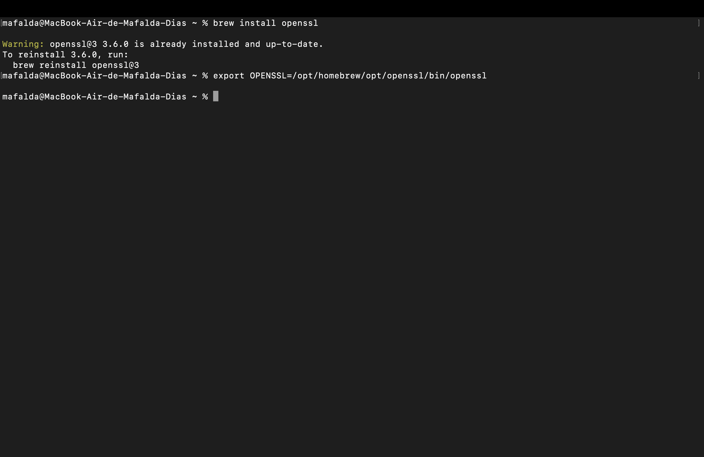
  <figcaption><b>Figure 1</b>–Installing/verifying OpenSSL via Homebrew and setting an OpenSSL path variable.</figcaption>

  
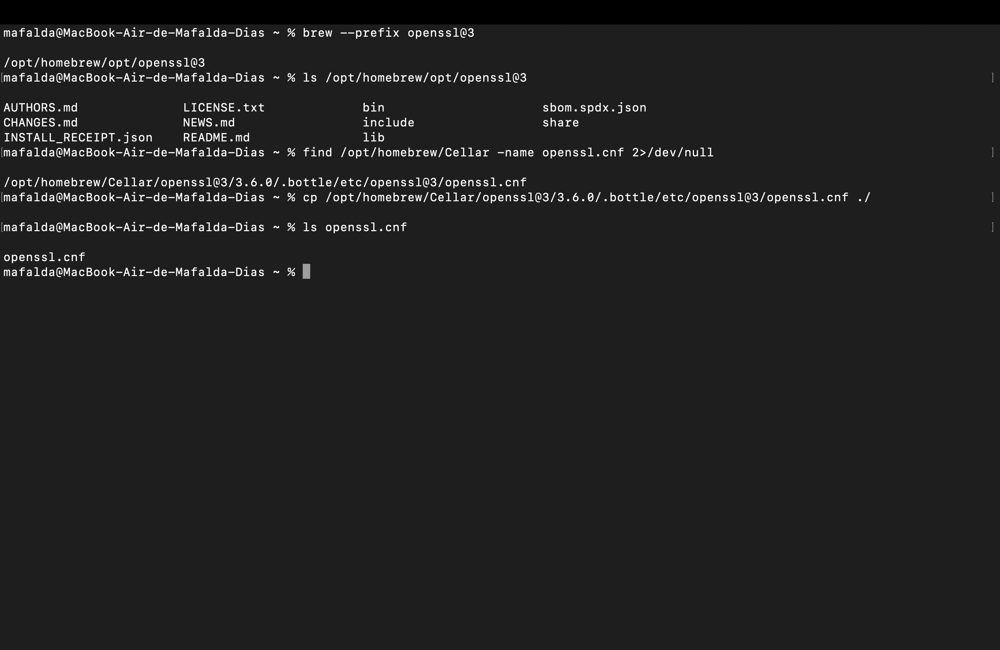
<figcaption><b>Figure 2</b>–Locating the Homebrew OpenSSL configuration file and copying <code>openssl.cnf</code> into the working directory.</figcaption>

#### 2 Editing `openssl.cnf` (CA defaults)

We then opened the copied openssl.cnf file using the nano editor and navigated to the CA configuration section. As required by the lab, we enabled support for issuing multiple certificates with the same subject by uncommenting the following option:

* `unique_subject = no`

This setting becomes important later, as it allows the CA to reissue certificates for the same hostname without rejecting them.


<figcaption><b>Figure 3</b>–Opening the copied <code>openssl.cnf</code> file using the nano text editor.</figcaption>

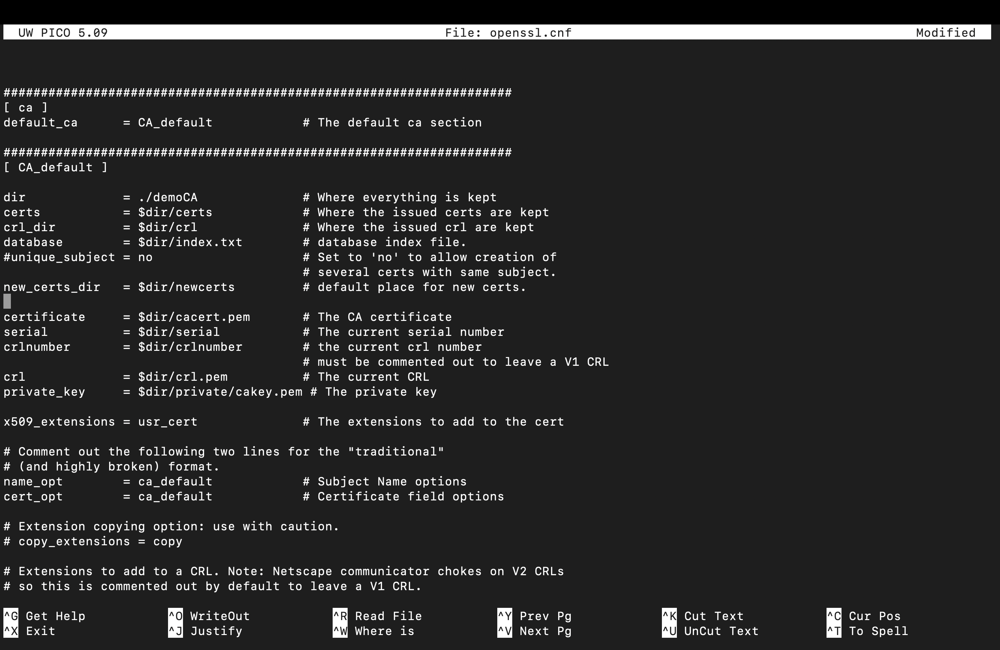
<figcaption><b>Figure 4</b>–Viewing the <code>[ CA_default ]</code> section of <code>openssl.cnf</code> before enabling duplicate-subject certificates.</figcaption>

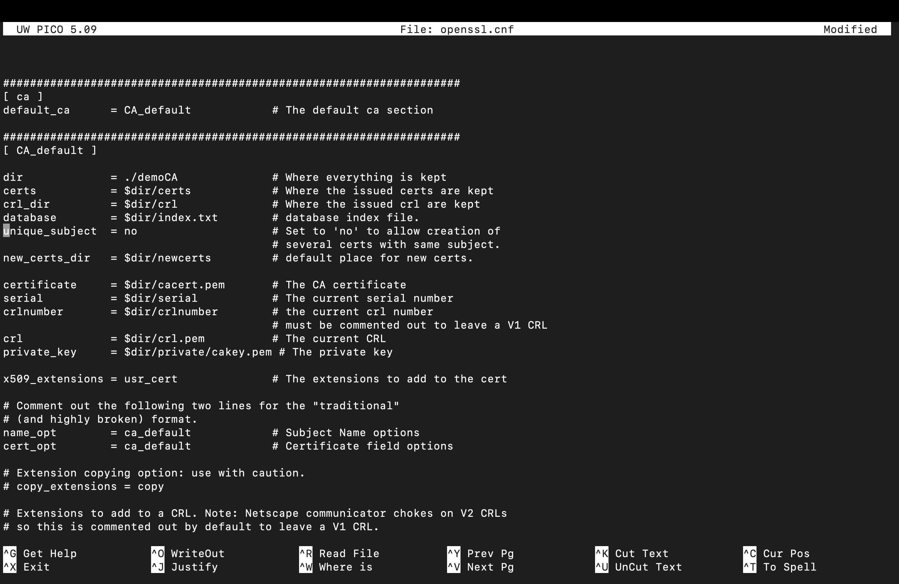
<figcaption><b>Figure 5</b>–Enabling the <code>unique_subject = no</code> option to allow issuing multiple certificates with the same subject.</figcaption>

#### 3. Creating the CA directory structure (`demoCA`)

OpenSSL expects a specific directory layout for Certificate Authorities. Following the configuration defaults and the lab instructions, we created the required demoCA directory structure and initialized the two mandatory database files:

* `index.txt` as an empty database index
* `serial` initialized to `1000`

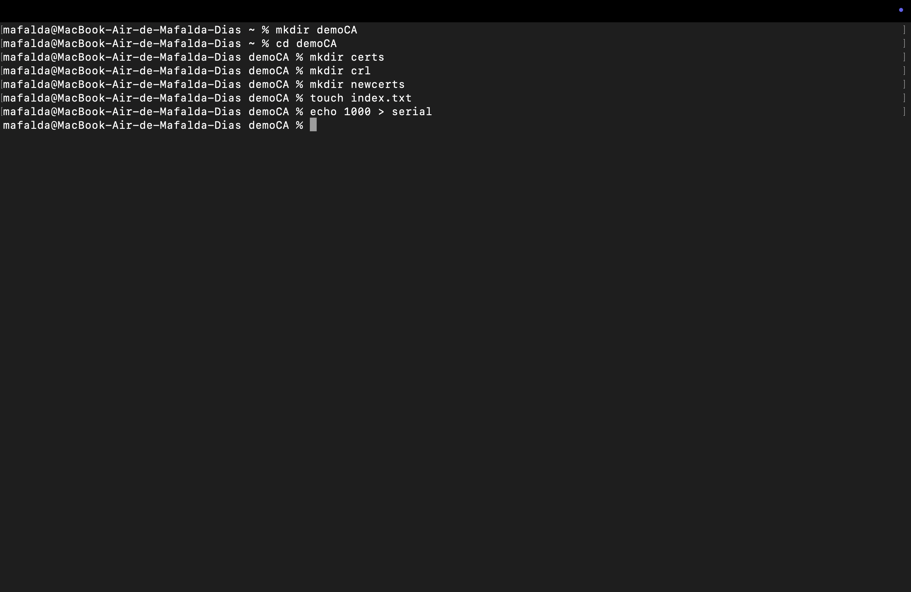
<figcaption><b>Figure 6</b>–Creating the <code>demoCA</code> directory structure and initializing the <code>index.txt</code> and <code>serial</code> files.</figcaption>


#### 4. Generating the root CA key + self-signed certificate

With the CA structure in place, we generated the root CA’s private key and self-signed certificate using the following command:

```bash
openssl req -x509 -newkey rsa:4096 -sha256 -days 3650 \
  -keyout ca.key -out ca.crt
```

This command generates a 4096-bit RSA key pair and immediately creates a self-signed X.509 certificate valid for 10 years. During execution, OpenSSL prompted us to set a passphrase to protect the private key (ca.key) and to enter the Distinguished Name (DN) fields for the CA.

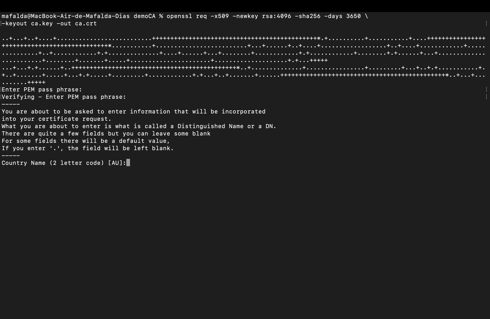
<figcaption><b>Figure 7</b>–Generating the self-signed root CA certificate using the <code>openssl req -x509</code> command.</figcaption>


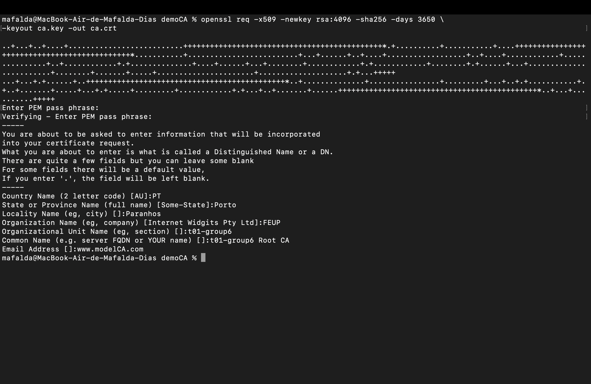
<figcaption><b>Figure 8</b>–Entering the Distinguished Name (DN) information for the root CA certificate.</figcaption>

As shown in the screenshot, we entered:

* **C** = PT
* **ST** = Porto
* **L** = Paranhos
* **O** = FEUP
* **OU** = t01-group6
* **CN** = t01-group6 Root CA
* **emailAddress** = [www.modelCA.com](http://www.modelCA.com)

#### 5. Inspecting the certificate and key (the lab questions come from here)

To answer the lab questions and verify the generated artifacts, we inspected both the CA certificate and its private key using OpenSSL’s decoding tools:

```bash
openssl x509 -in ca.crt -text -noout
openssl rsa  -in ca.key -text -noout
```

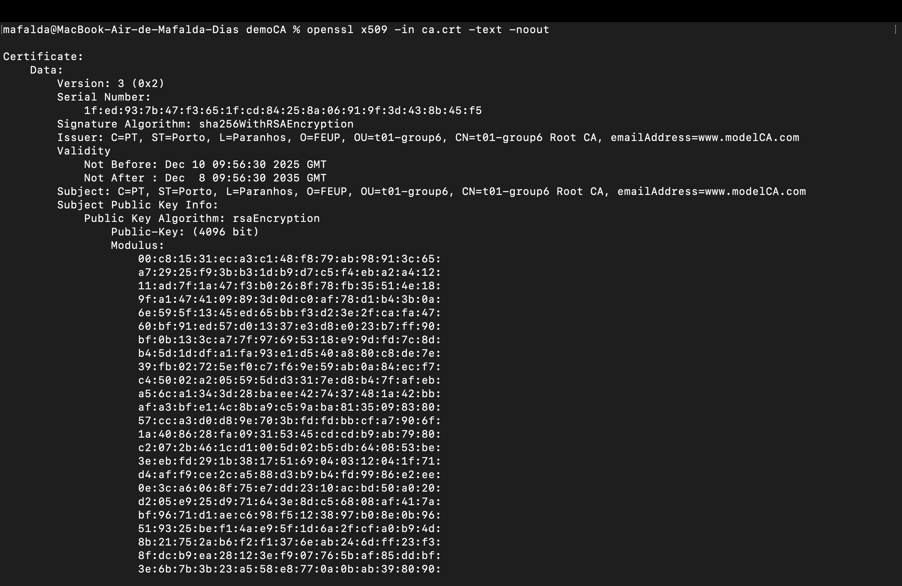
<figcaption><b>Figure 9</b>–Decoded output of the CA certificate showing version, serial number, issuer, subject, and validity period.</figcaption>


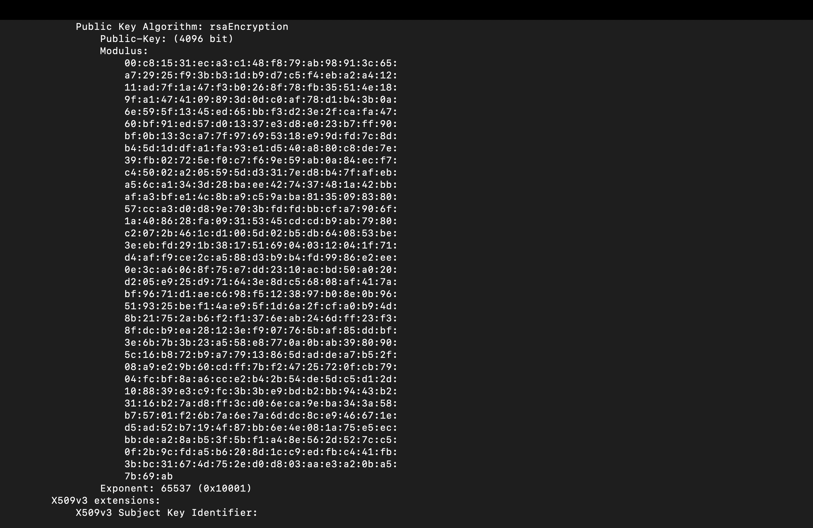
<figcaption><b>Figure 10</b>–Decoded certificate output displaying the RSA public key modulus and public exponent.</figcaption>


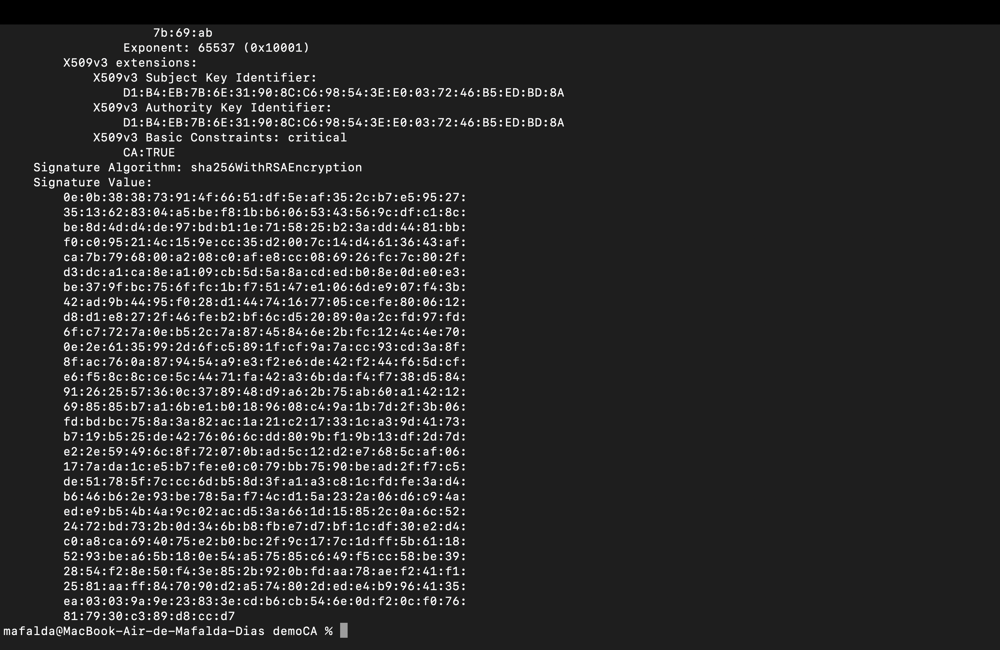
<figcaption><b>Figure 11</b>–X509v3 extensions confirming CA status through <code>Basic Constraints: CA:TRUE</code>.</figcaption>

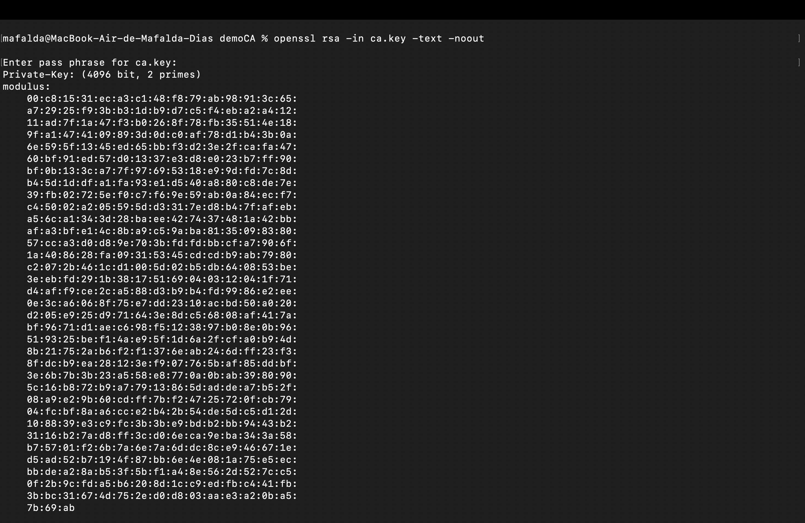
<figcaption><b>Figure 12</b>–Decoded RSA private key output showing the 4096-bit modulus <code>n</code>.</figcaption>


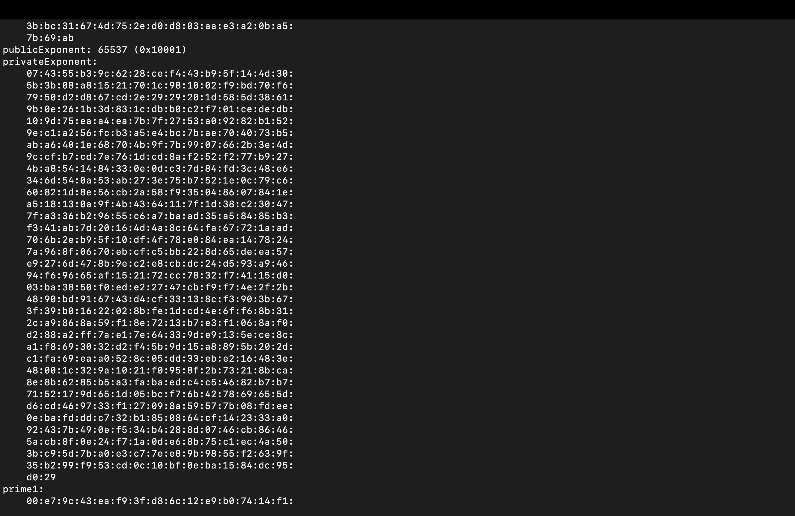
<figcaption><b>Figure 13</b>–RSA private key output displaying the public exponent <code>e</code> and private exponent <code>d</code>.</figcaption>

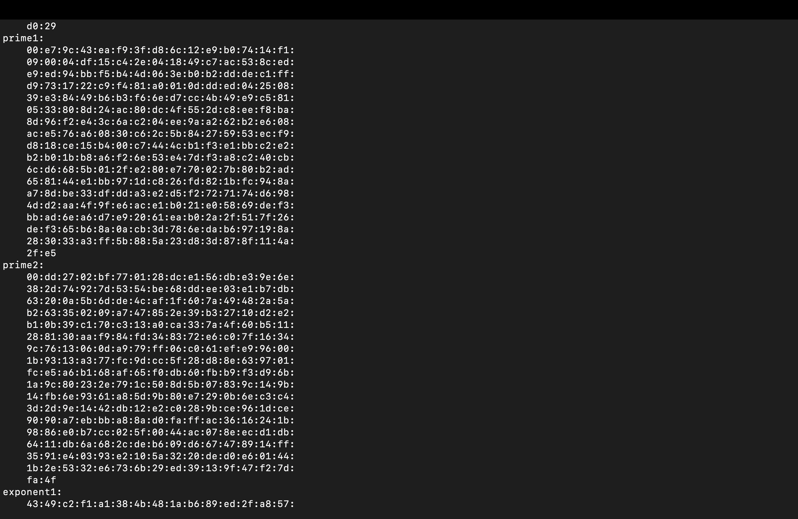
<figcaption><b>Figure 14</b>–RSA private key output showing the prime numbers <code>p</code> (prime1) and <code>q</code> (prime2).</figcaption>

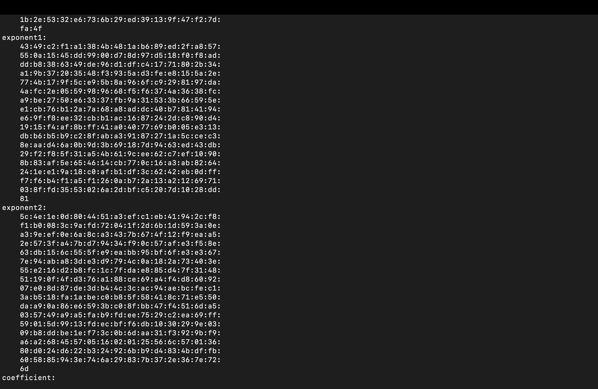
<figcaption><b>Figure 15</b>– RSA private key output (continuation) </figcaption>

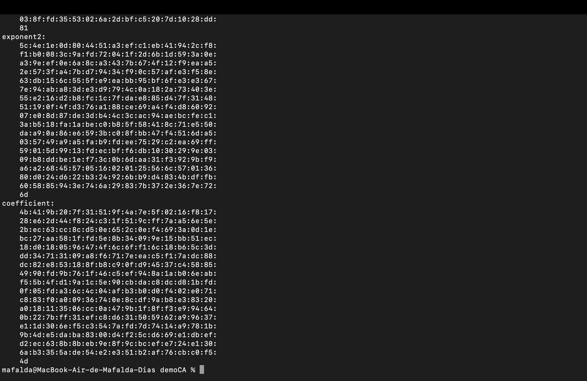
<figcaption><b>Figure 16</b>–RSA private key output (finalization) </figcaption>

---

##  Answers to the lab questions

### Q1 — What indicates that this is a CA certificate?

The certificate includes the X509v3 Basic Constraints extension marked as critical and set to CA:TRUE. This explicitly authorizes the certificate to act as a Certificate Authority.

### Q2 — What indicates that the certificate is self-signed?

This is evident because the Issuer and Subject fields contain identical Distinguished Names. Additionally, the Authority Key Identifier matches the Subject Key Identifier, which is expected when a certificate signs itself.

### Q3 — Identifying RSA parameters

From the decoded outputs:

- Public exponent (e): 65537 (0x10001)

- Modulus (n): displayed in both the certificate and private key outputs

- Private exponent (d): shown as privateExponent in the private key

- Prime factors (p and q): shown as prime1 and prime2

These values confirm that the CA uses a correctly generated 4096-bit RSA key pair.


---

## Conclusions

By the end of this task, we successfully set up a functional root Certificate Authority. We prepared the CA configuration, created the required directory structure, generated a protected 4096-bit RSA key, and issued a self-signed root CA certificate. Inspection confirmed that the certificate is self-signed, authorized as a CA, and correctly configured for subsequent certificate issuance.

---

## Task 2 —  Generating a Certificate Request for Your Web Server

In this task, we generated a Certificate Signing Request (CSR) for a web server that will later request a certificate from the CA created in Task 1. The CSR contains the server’s public key and identity information, which the CA uses to issue a signed certificate.

Unlike the CA certificate, this step intentionally produces a request, not a certificate, so the -x509 option is omitted.

---

### 1. Generating the server private key and CSR

We generated a new 2048-bit RSA private key and a CSR using the following command:

```bash
openssl req -newkey rsa:2048 -sha256 \
-keyout server.key -out server.csr \
-subj "/CN=www.group06.com/O=FEUP/C=PT" \
-passout pass:dees \
-addext "subjectAltName = DNS:www.group06.com, DNS:www.group06A.com, DNS:www.group06B.com"
```

This creates the server’s private key, embeds the identity information, and includes a Subject Alternative Name (SAN) extension containing all hostnames that the server should be valid for.

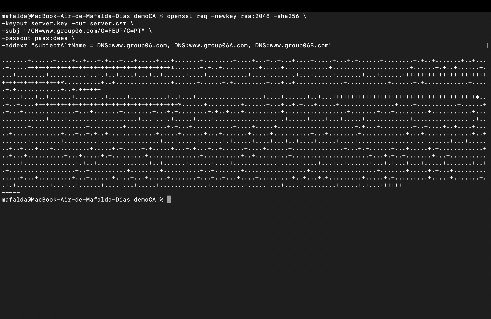

<figcaption><b>Figure 17</b>–Generating a 2048-bit RSA private key and a Certificate Signing Request (CSR) with Subject Alternative Names.</figcaption>


---

### 2. Inspecting the generated CSR

We inspected the CSR to ensure that the subject and public key were correctly embedded:

```bash
openssl req -in server.csr -text -noout
```

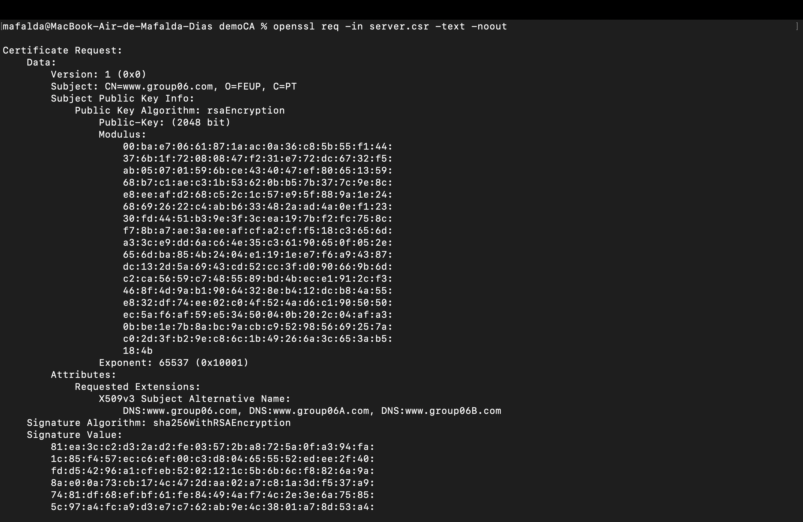

<figcaption><b>Figure 18</b>–Decoded CSR output showing the subject information and RSA public key parameters.</figcaption>

From the decoded CSR output, we observe:

* **Subject**:

  ```
  CN=www.group06.com, O=FEUP, C=PT
  ```

  This matches exactly the identity information provided during CSR generation.

* **Public Key Information**:

  * Algorithm: RSA
  * Key size: 2048 bits
  * Public exponent: 65537 (0x10001)

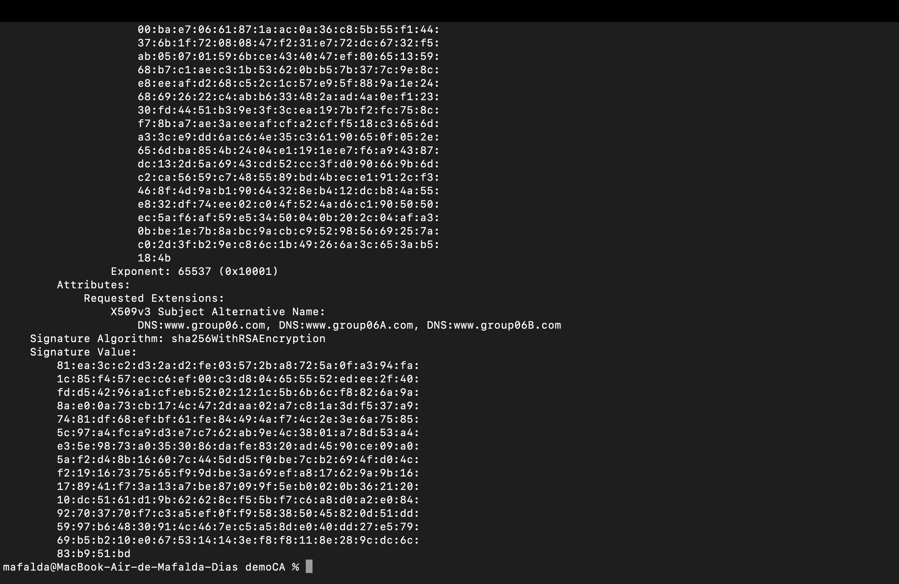

<figcaption><b>Figure 19</b>–CSR extensions showing the Subject Alternative Name (SAN) field.</figcaption>

The decoded output confirms that the SAN extension includes all required DNS entries, which is essential for browser compatibility.

```
DNS:www.group06.com
DNS:www.group06A.com
DNS:www.group06B.com
```


---

## 3. Inspecting the server private key

After generating the CSR, we inspected the server’s private key to confirm that it was correctly generated and that it matched the public key included in the CSR.

The following command was used:

```bash
openssl rsa -in server.key -text -noout
```

After entering the passphrase, OpenSSL successfully decoded the key.

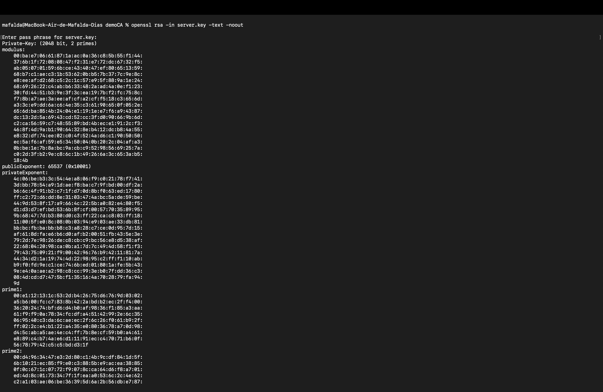

<figcaption><b>Figure 20</b>–Decoded RSA private key showing the modulus and public/private exponents.</figcaption>

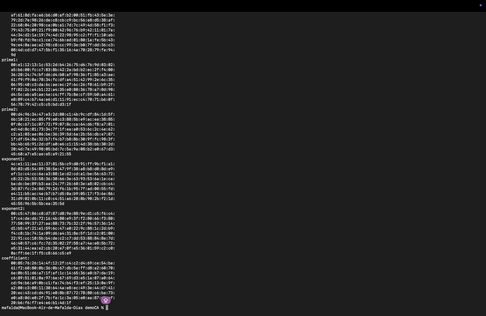

<figcaption><b>Figure 21</b>–Decoded RSA private key showing the prime factors and CRT parameters.</figcaption>

From this output, we confirmed that:

- the private key is a 2048-bit RSA key, as required;

- the key is valid and protected with a passphrase;

- the key structure is consistent with the public key used in the CSR.

---

## Conclusions

At the end of this task, we had a valid server private key and CSR containing the correct identity information and SAN entries. These artifacts are now ready to be signed by the Certificate Authority created earlier.


---

## Task 3 - Generating a Certificate for the Web Server

In this task, we used the Certificate Authority created in Task 1 to sign the server’s CSR from Task 2 and issue a proper X.509 server certificate. This mirrors what happens in a real PKI setup, except here the CA is under our control instead of being a public provider.

---

### 1. Preparing the OpenSSL configuration file

Before signing the CSR, we double-checked that the CA configuration was correctly set up and adjusted one important option so that browser-required extensions (namely SAN) would not be lost.

#### 1.1 CA default settings

The OpenSSL configuration file (openssl.cnf) defines how the CA operates and where it stores its files. In particular, the [ CA_default ] section specifies the CA’s working directory, certificate database, and key locations.

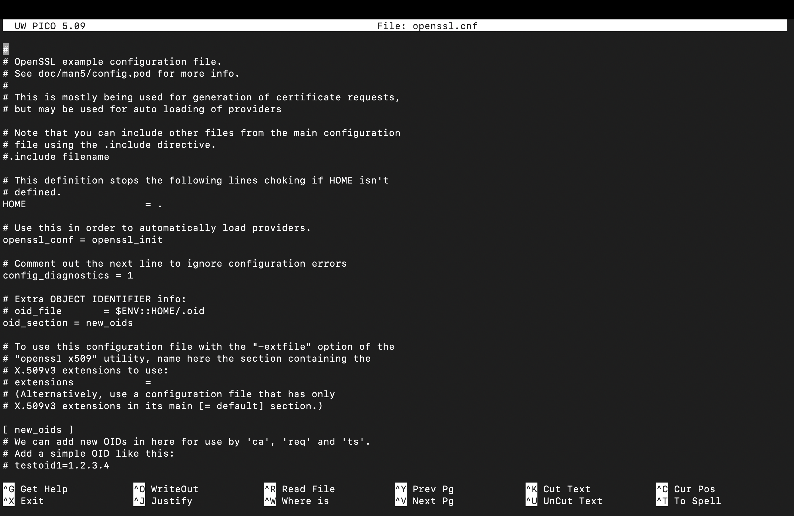

<figcaption><b>Figure 22</b>–Opening the OpenSSL configuration file (<code>openssl.cnf</code>) in the Pico editor.</figcaption>

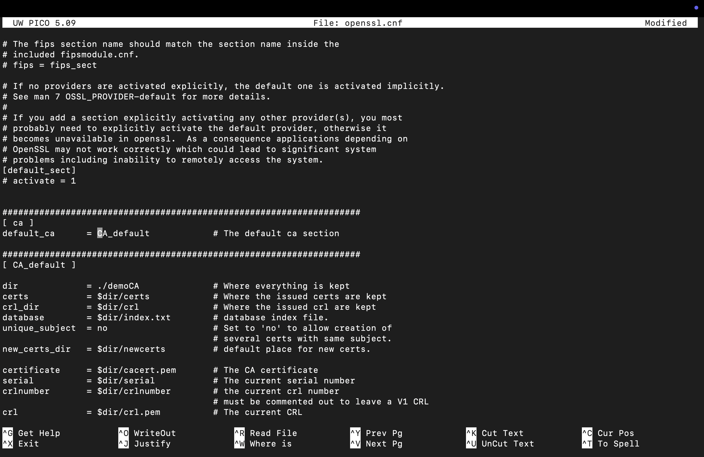

<figcaption><b>Figure 23</b>–<code>[ CA_default ]</code> section showing the CA directory, database, and serial number configuration.</figcaption>

From this section, we can see that:

* the CA directory is `./demoCA`;
* issued certificates are tracked via `index.txt`;
* serial numbers are stored in `serial`;
* the CA private key is stored in `demoCA/private/cakey.pem`.

This matches the directory structure created earlier in Task 1.

---

#### 1.2 Enabling extension copying

By default, OpenSSL does not copy extensions from a CSR into the final certificate. This is a problem because it would silently drop the Subject Alternative Name (SAN) extension, even if it was present in the CSR.

To avoid that, we enabled extension copying by uncommenting the following line in openssl.cnf:

```ini
copy_extensions = copy
```

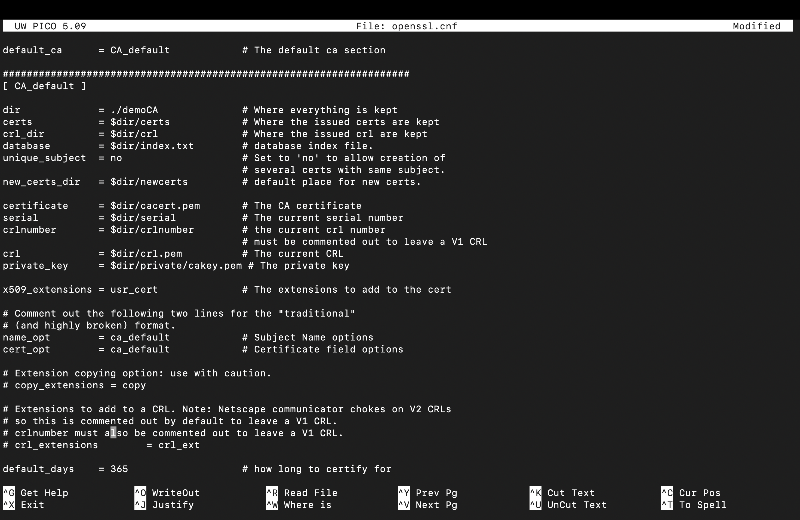

<figcaption><b>Figure 24</b>–Enabling extension copying to allow SAN fields from the CSR to be included in the issued certificate.</figcaption>


---

### 2. Signing the server CSR with the CA

With the configuration ready, we used the CA’s private key to sign the server’s CSR and issue the final certificate.

The following command was executed:

```bash
openssl ca -config openssl.cnf -policy policy_anything \
-md sha256 -days 3650 \
-in demoCA/server.csr -out demoCA/server.crt -batch \
-cert demoCA/ca.crt -keyfile demoCA/ca.key
```

In short, this command:

* uses our CA configuration file;
* applies a permissive policy (policy_anything);
* signs the certificate using SHA-256;
* sets a validity period of 3650 days (10 years);
* uses the CA’s certificate and private key to sign the CSR.

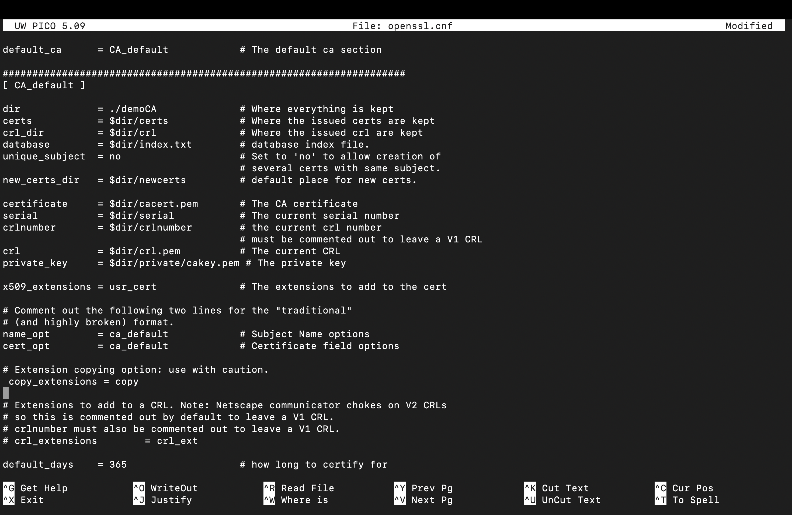

<figcaption><b>Figure 25</b>–Signing the server CSR using the CA private key and certificate.</figcaption>

From the command output, we can confirm that:

* the CSR signature was successfully verified;
* a new serial number (`4096 / 0x1000`) was assigned;
* the CA database was updated.

This confirms that the certificate was successfully issued by the CA.

---

### 3. Inspecting the generated server certificate

After issuing the certificate, we decoded it to verify that the information matched what we requested and that no extensions were missing.

We used the following command:

```bash
openssl x509 -in demoCA/server.crt -text -noout
```

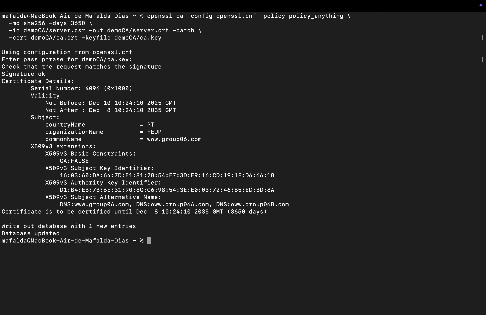

<figcaption><b>Figure 26</b>–Decoded server certificate showing issuer, subject, and validity period.</figcaption>

From the decoded output, we verified that:

* **Issuer**:
  The issuer matches the Root CA created in Task 1, confirming that the certificate was signed by our CA.

* **Subject**:

  ```
  C=PT, O=FEUP, CN=www.group06.com
  ```

  This matches the subject specified in the CSR.

* **Public Key**:

  * Algorithm: RSA
  * Key size: 2048 bits
  * Public exponent: 65537

---

### 4. Verifying certificate extensions

Next, we checked the X.509 extensions to ensure the certificate has the correct role and browser-required fields.

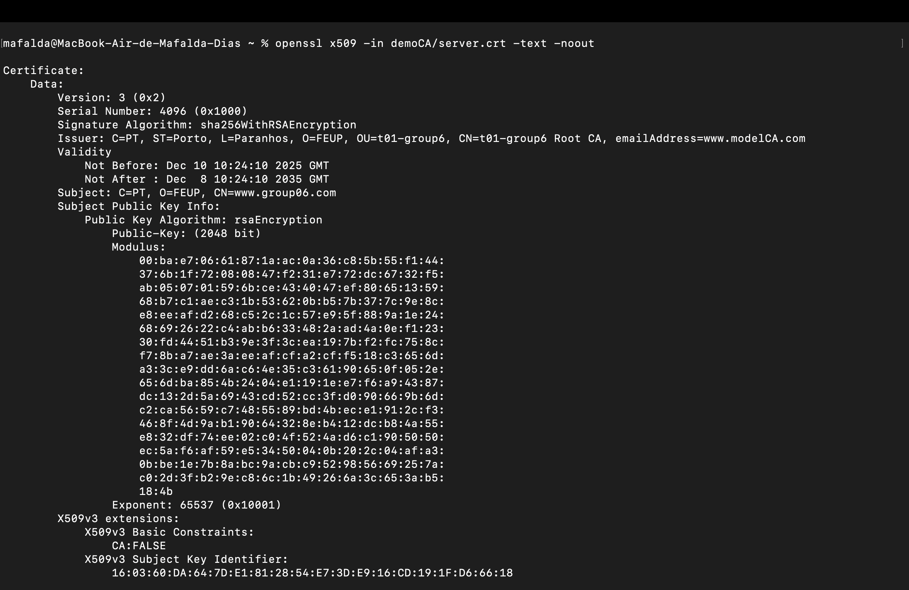

<figcaption><b>Figure 28</b>–X509v3 extensions confirming that the certificate is not a CA certificate.</figcaption>

The Basic Constraints extension shows:

```
CA:FALSE
```

This confirms that the issued certificate is a server certificate, not a CA certificate, which is exactly what we want.

---

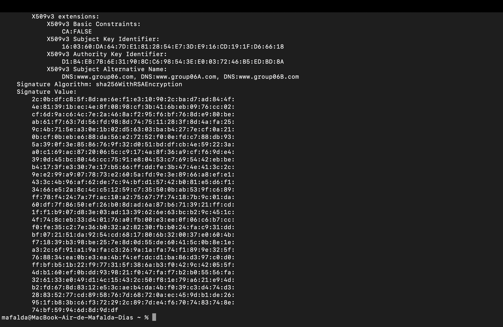

<figcaption><b>Figure 29</b>–Subject Alternative Name (SAN) extension included in the issued server certificate.</figcaption>

We also verified that the Subject Alternative Name (SAN) extension was included and contains all requested hostnames:

```
DNS:www.group06.com
DNS:www.group06A.com
DNS:www.group06B.com
```

This confirms that:

* the SAN extension from the CSR was correctly copied into the final certificate;
* all required hostnames are present and will be accepted by modern browsers.

---

## Conclusions

By the end of this task, we:

* prepared the CA configuration to preserve CSR extensions;
* used our self-created Certificate Authority to sign a server CSR;
* generated a valid X.509 server certificate (server.crt);
* verified that the certificate:

  * was issued by our CA,
  * is marked as CA:FALSE,
  * includes the correct subject information,
  * and contains all required Subject Alternative Names (SANs).

At this point, the server certificate is complete and ready to be deployed on a web server to enable HTTPS.

---

## Task 4 - 

In this task, we deployed the server certificate generated in Task 3 on an Apache web server running inside a Docker container, enabling HTTPS for the website. This demonstrates how public-key certificates are used in practice to secure web communication.

---

## 1. Hostname resolution setup

Before configuring HTTPS, we ensured that all required hostnames resolved to the Apache container’s IP address. To achieve this, we added the following entries to the local /etc/hosts file, mapping the group06 domains to the container IP (10.9.0.80).

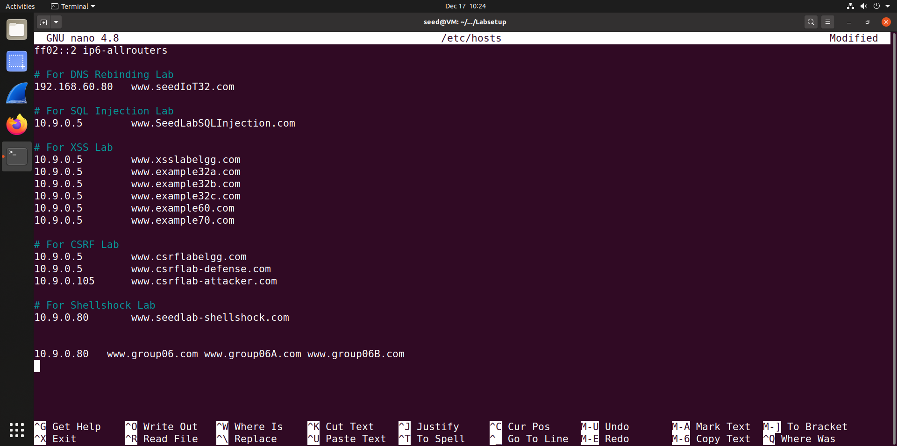
<figcaption><b>Figure 30</b>–Editing the <code>/etc/hosts</code> file to map <code>www.group06.com</code>, <code>www.group06A.com</code>, and <code>www.group06B.com</code> to the container IP address (10.9.0.80).</figcaption>

We then verified that hostname resolution was working correctly using the getent hosts command.

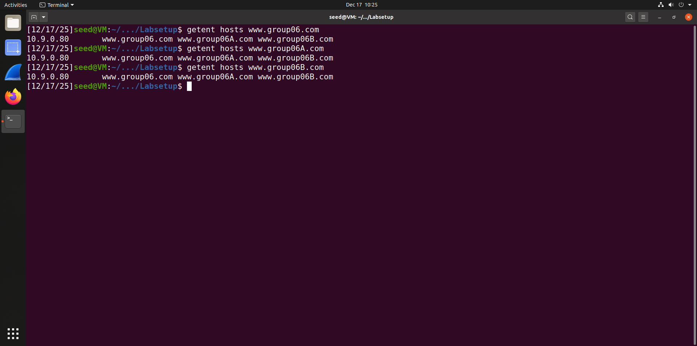
<figcaption><b>Figure 31</b>–Verifying local hostname resolution using the <code>getent hosts</code> command for the group06 domains.</figcaption>

## 2. Making the certificate available to the container

To allow Apache to access the TLS materials, we copied the generated server certificate and private key into the shared Docker volumes/ directory. This directory is mounted inside the container, making the files accessible without rebuilding the container.

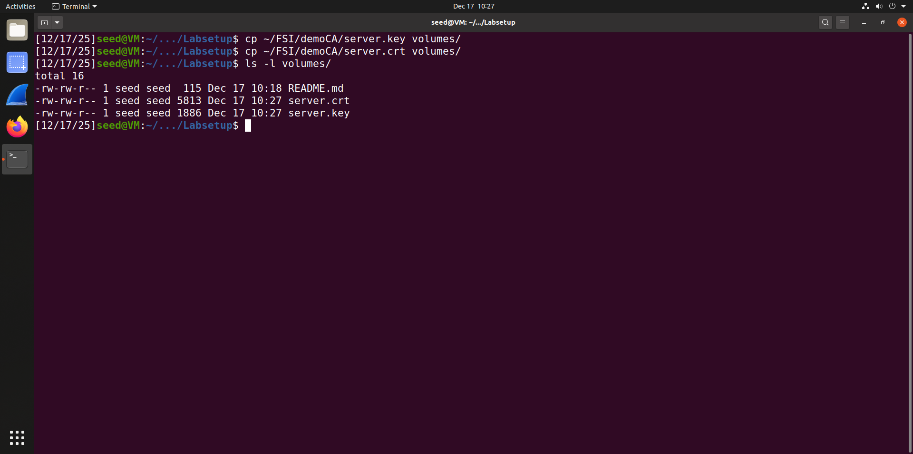
<figcaption><b>Figure 32</b>–Copying the generated TLS server certificate (<code>server.crt</code>) and private key (<code>server.key</code>) from the local PKI directory into the Docker <code>volumes/</code> directory so they can be mounted and used by the Apache HTTPS container.</figcaption>

## 3. Apache HTTPS virtual host configuration

Next, we accessed the Apache container shell and inspected the available site configuration files.

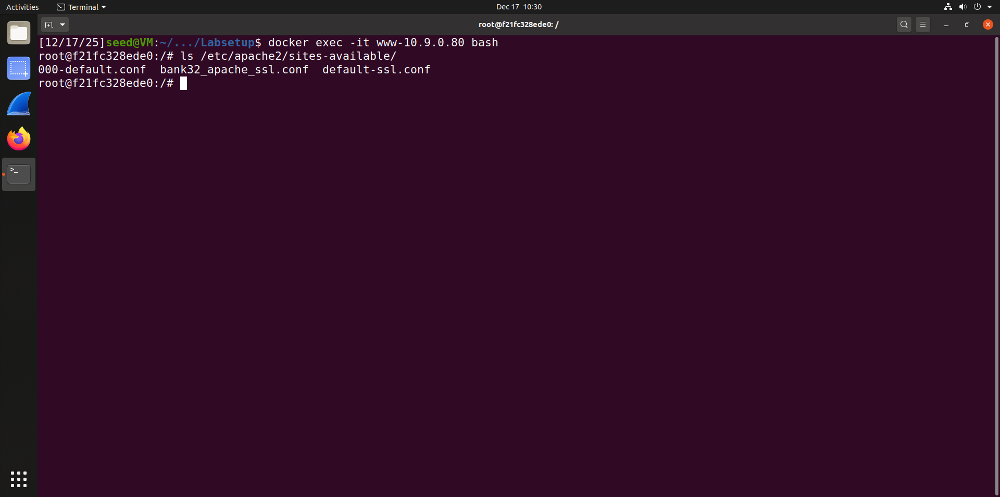
<figcaption><b>Figure 33</b>–Starting the Apache web server container and entering its shell using <code>docker exec</code>, then listing the available Apache site configuration files under <code>/etc/apache2/sites-available/</code>.</figcaption>

We then created a new HTTPS virtual host configuration for the group06 website by copying the provided reference configuration file and adapting it to our setup.

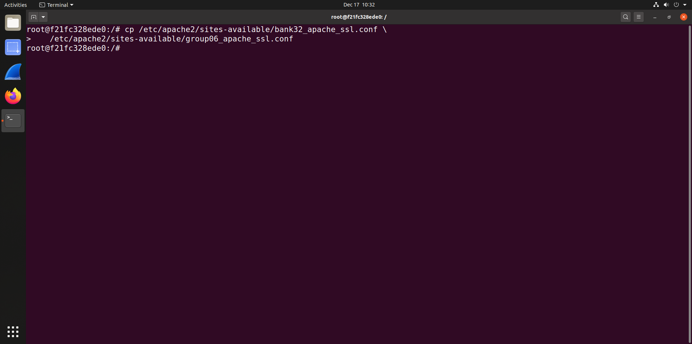
<figcaption><b>Figure 34</b>–Copying the reference HTTPS configuration file (<code>bank32_apache_ssl.conf</code>) to create a new configuration file (<code>group06_apache_ssl.conf</code>) for the group06 HTTPS virtual host.</figcaption>

The new configuration file was edited to:

- set the correct DocumentRoot;

- define the ServerName and ServerAlias entries;

- reference the correct TLS certificate and private key paths.

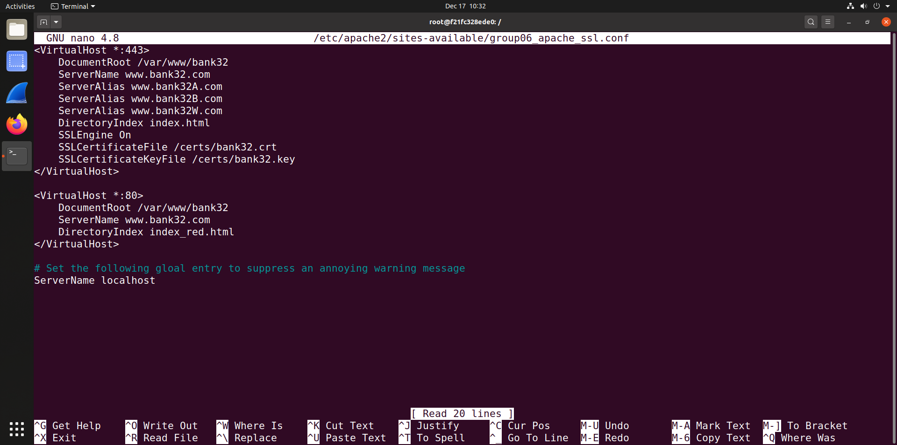
<figcaption><b>Figure 35</b>–Editing the newly created Apache HTTPS configuration file (<code>group06_apache_ssl.conf</code>) to update the document root, server names, aliases, and SSL certificate paths for the group06 website.</figcaption>

The final configuration defines both HTTP and HTTPS virtual hosts and enables TLS using the generated server certificate.

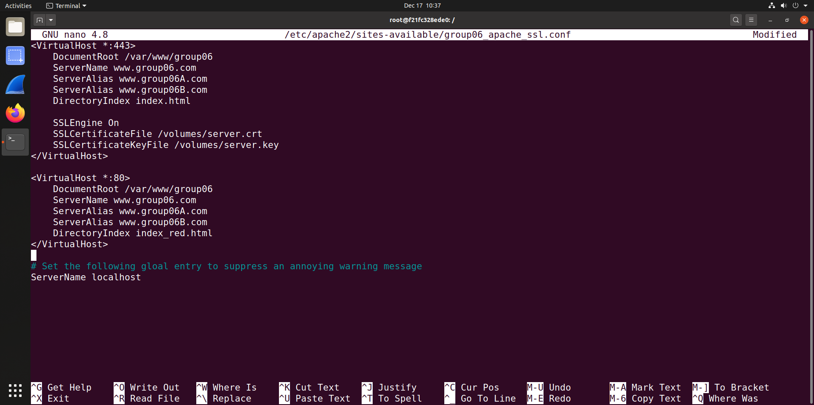
<figcaption><b>Figure 36</b>–Finalizing the Apache HTTPS virtual host configuration for group06, defining both HTTP and HTTPS virtual hosts and enabling TLS using the generated server certificate and private key.</figcaption>

## 4. Website content preparation

Inside the container, we created the document root directory for the group06 website and added simple HTML files. Different pages were used for HTTP and HTTPS access to make it clear which protocol was being used.

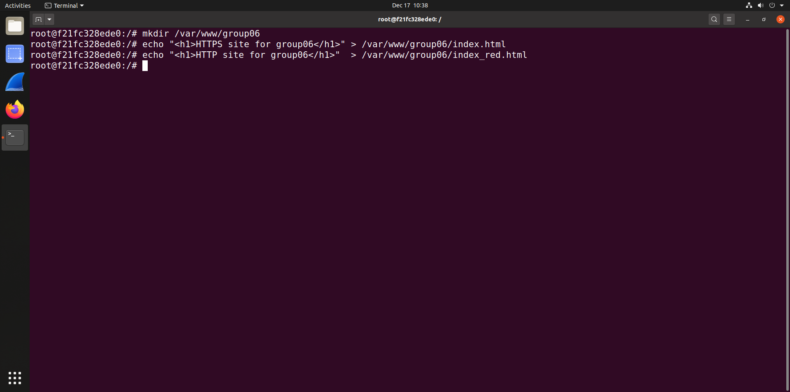
<figcaption><b>Figure 37</b>–Creating the document root directory for the group06 website inside the Apache container and generating simple HTML files to distinguish between HTTP (<code>index_red.html</code>) and HTTPS (<code>index.html</code>) access.</figcaption>

## 5. Enabling SSL and starting Apache

We enabled Apache’s SSL module, activated the new HTTPS site configuration, and disabled the default sites to ensure that only the group06 configuration was served.

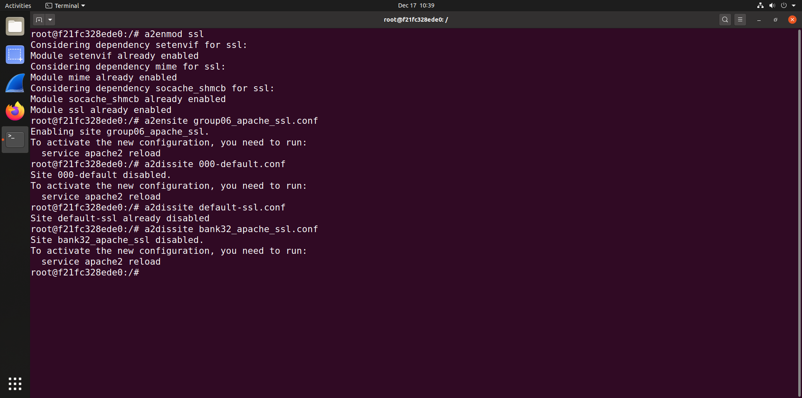
<figcaption><b>Figure 38</b>–Enabling the Apache SSL module, activating the <code>group06_apache_ssl.conf</code> virtual host configuration, and disabling the default HTTP and HTTPS sites to ensure only the group06 configuration is served.</figcaption>

We then validated the Apache configuration and started the Apache web server. Since the server’s private key is encrypted, Apache prompted for the passphrase during startup.

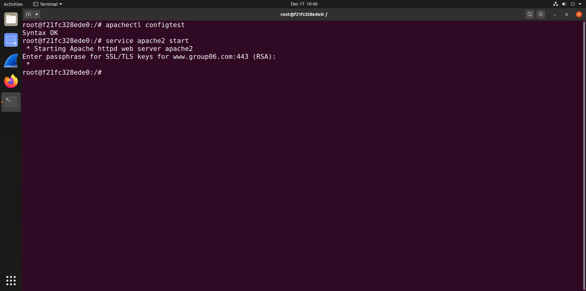
<figcaption><b>Figure 39</b>–Validating the Apache configuration and starting the Apache web server, unlocking the encrypted private key when prompted.</figcaption>

To confirm that Apache was running correctly, we verified that it was listening on TCP port 443.

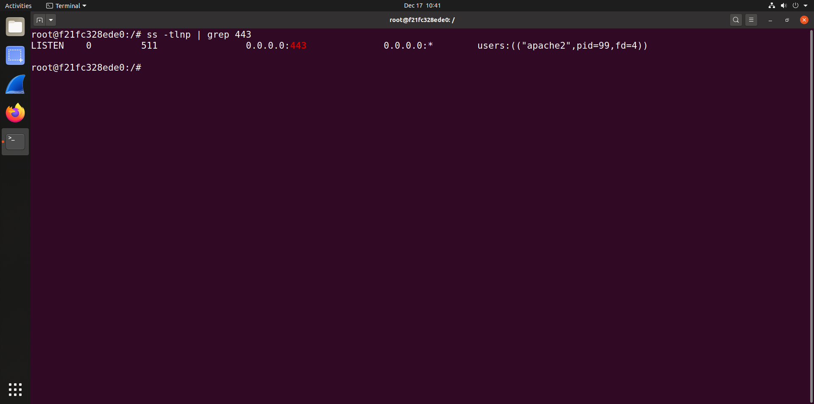
<figcaption><b>Figure 40</b>–Verifying that the Apache web server inside the container is actively listening on TCP port 443 using the <code>ss -tlnp</code> command.</figcaption>

## 6. Accessing the HTTPS website and trust establishment

When initially accessing https://www.group06.com, the browser displayed a security warning. This occurs because the server certificate was signed by the custom Root Certificate Authority created in Task 1. Since this CA is not present in Firefox’s trusted Authorities store by default, the browser cannot establish a valid certificate trust chain from the server certificate to a trusted root, and therefore marks the connection as untrusted.

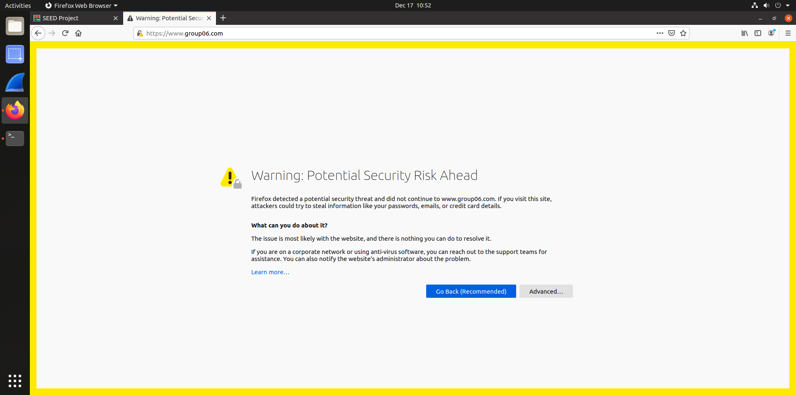
<figcaption><b>Figure 41</b>–Attempting to access <code>https://www.group06.com</code> before trusting the custom Certificate Authority, resulting in a Firefox security warning.</figcaption>

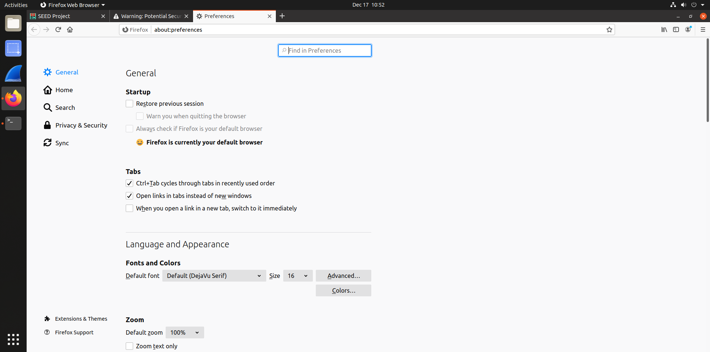
<figcaption><b>Figure 42</b>–Opening Firefox preferences to access privacy and security settings in order to manage trusted certificates.</figcaption>

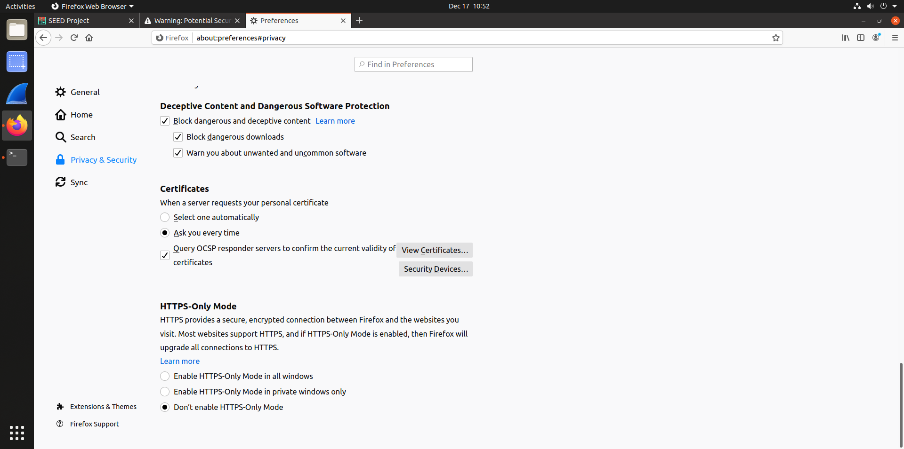
<figcaption><b>Figure 43</b>–Navigating to Firefox’s certificate management interface by selecting <b>View Certificates</b> under the Authorities section.</figcaption>

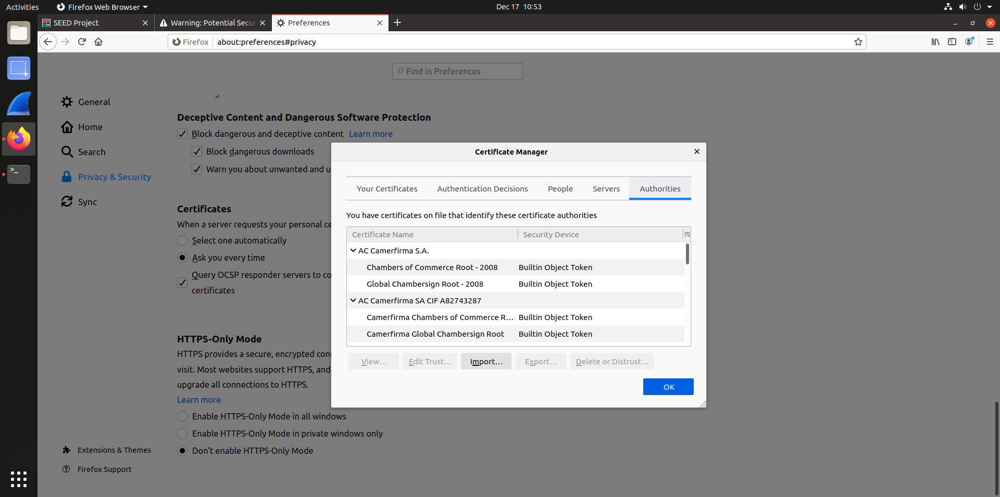
<figcaption><b>Figure 44</b>–Importing the custom Root CA certificate (<code>ca.crt</code>) into Firefox’s Authorities certificate store.</figcaption>

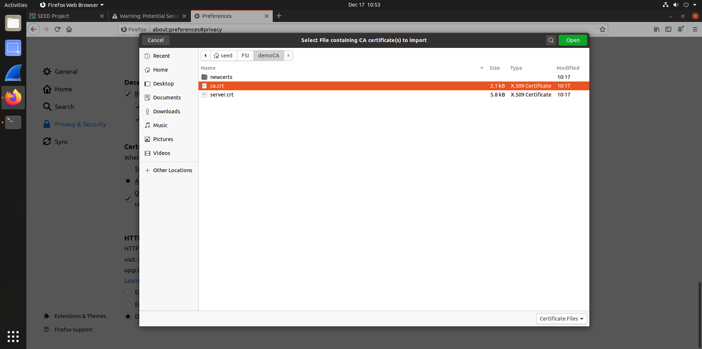
<figcaption><b>Figure 45</b>–Selecting the option to trust the imported Root CA for identifying websites during the certificate import process.</figcaption>

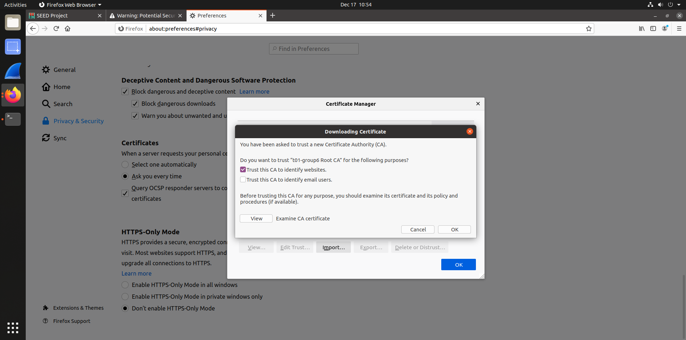
<figcaption><b>Figure 46</b>–Confirming that the custom Root CA (<code>t01-group6 Root CA</code>) now appears in Firefox as a trusted certificate authority.</figcaption>

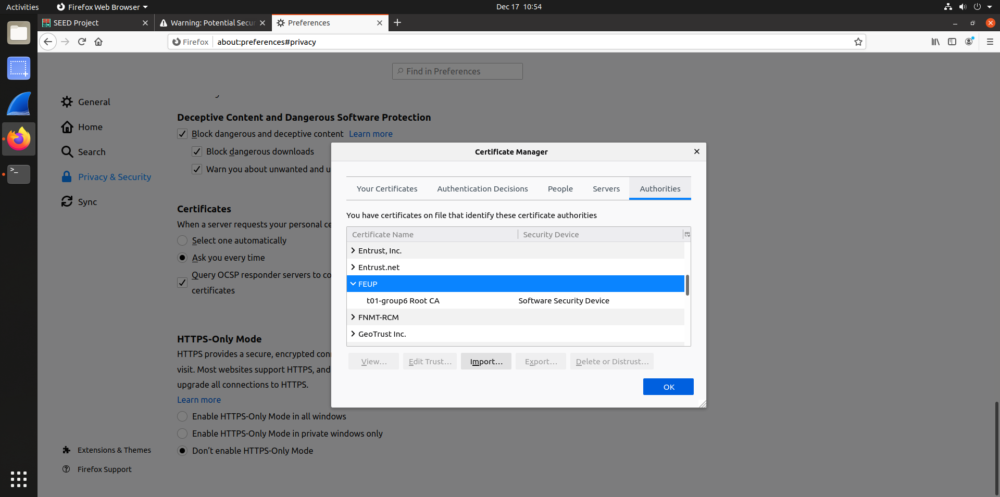
<figcaption><b>Figure 47</b>–Verifying that the custom Root CA (t01-group06 Root CA / FEUP) has been successfully imported into Firefox’s Authorities store.</figcaption>

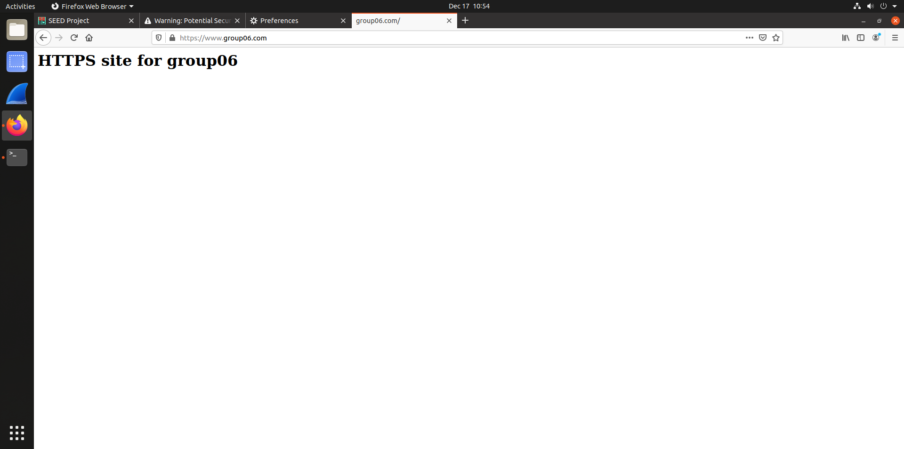
<figcaption><b>Figure 48</b>–Successfully accessing <code>https://www.group06.com</code> after trusting the custom Root CA, displaying the HTTPS webpage content served by the Apache container.</figcaption>

---

## Conclusions

In this task, we successfully deployed the server certificate on an Apache web server and enabled HTTPS communication. We configured hostname resolution, prepared the Apache HTTPS virtual host, enabled SSL, and demonstrated the trust relationship by importing the custom Root CA into the browser. After establishing trust, the HTTPS website could be accessed securely without warnings.

## Task 5: Launching a Man-In-The-Middle Attack

### **1. Setting up the malicious website**

We created a fake website to impersonate **www.example.com**. First, we set up a dedicated directory to host the malicious content:

```bash
mkdir -p /var/www/example
echo "<h1>Fake example.com - MITM</h1>" > /var/www/example/index.html
```

Then, we configured Apache to serve this fake website for HTTPS requests to **www.example.com**.

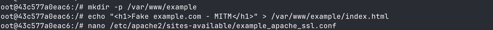

<figcaption><b>Figure 51</b> – Configuring Apache to host the malicious website for <code>www.example.com</code>.</figcaption>

**Important:**  
We intentionally used a certificate that was **not issued for www.example.com**. Instead, the certificate presented by the server was issued for **www.bank32.com**, clearly demonstrating a certificate hostname mismatch.

---

### **2. Becoming the Man-in-the-Middle**

To simulate DNS spoofing, a common technique used in MITM attacks, we modified the victim’s `/etc/hosts` file to redirect traffic for **www.example.com** to the malicious server’s IP address.

```bash
10.9.0.80 www.example.com
```

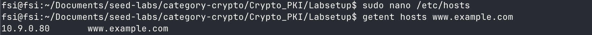

<figcaption><b>Figure 52</b> – Modifying <code>/etc/hosts</code> to redirect <code>www.example.com</code> to the malicious server at IP address <code>10.9.0.80</code>.</figcaption>

To verify that the redirection was active, we used the following command:

```bash
getent hosts www.example.com
```

**Output:**
```
10.9.0.80 www.example.com
```

This confirms that DNS resolution was successfully redirected to the attacker-controlled server.

---

### **3. Browsing the target website**

With the malicious server and DNS spoofing in place, we attempted to access **https://www.example.com** using the Firefox browser.

**Result:**  
Firefox immediately displayed a security warning and refused to establish the connection.

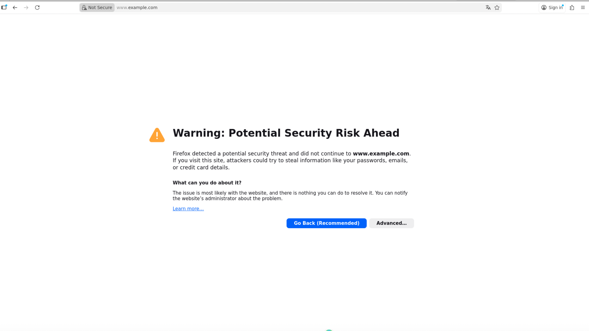

<figcaption><b>Figure 53</b> – Firefox blocking access due to a certificate mismatch. The presented certificate was issued for <code>www.bank32.com</code>, not for <code>www.example.com</code>.</figcaption>

---

### **4. Verifying DNS configuration**

To confirm the DNS redirection was properly configured, we displayed the complete /etc/hosts file:

```bash
cat /etc/hosts
```

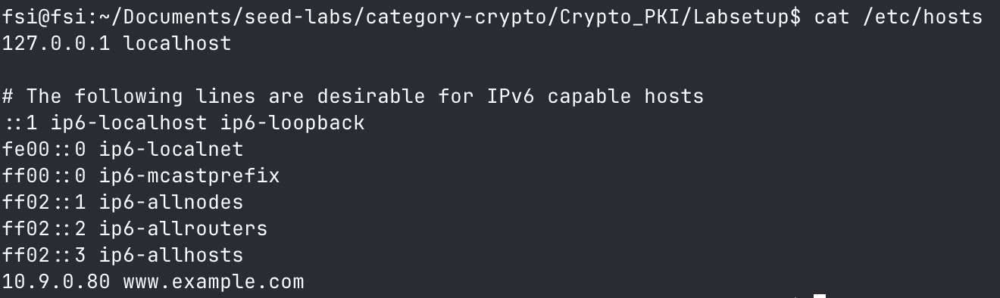

<figcaption><b>Figure 54</b> – Complete <code>/etc/hosts</code> configuration confirming the DNS spoofing setup.</figcaption>

---

### **5. Certificate details analysis**

Inspection of the presented certificate revealed the following details:

* **Subject:** CN = www.bank32.com  
* **Issuer:** CN = ModelCA_Refreshed  
* **Validity:** The certificate was issued for a completely different domain than the one being accessed.

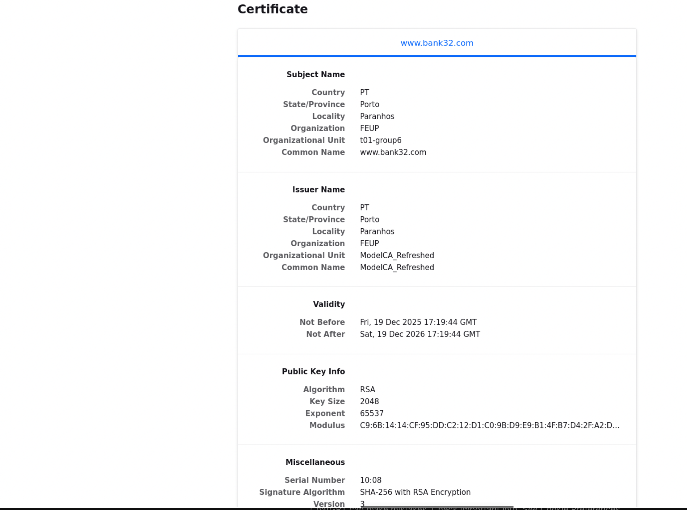

<figcaption><b>Figure 54</b> – Certificate details confirming that the certificate was issued for <code>www.bank32.com</code> and not for <code>www.example.com</code>.</figcaption>

---

### **Analysis and Conclusions**

The browser’s security warning clearly demonstrates that Public Key Infrastructure (PKI) successfully prevented the Man-In-The-Middle attack. This occurred due to several built-in security mechanisms:

* **Certificate Name Validation:**  
  During the TLS handshake, the browser verifies that the certificate’s Common Name (CN) matches the requested hostname. In this case, the certificate was valid only for **www.bank32.com**, while the requested domain was **www.example.com**.

* **Automatic Protection:**  
  Modern browsers perform this validation automatically without requiring user intervention.

* **Clear User Warning:**  
  Firefox presented a clear and explicit warning explaining the risk and advising against proceeding.

**Key Takeaway:**  
Even though network traffic was successfully redirected to a malicious server through DNS spoofing, it was not possible to establish a trusted HTTPS connection without a valid certificate for the target domain.

This experiment confirms that certificate validation is a critical defense mechanism in HTTPS, ensuring that users communicate only with legitimate servers and not with impostors.


## Task 6: Launching a Man-In-The-Middle Attack with a Compromised CA

In this task, we explored the catastrophic consequences of a compromised Certificate Authority (CA). By assuming possession of the Root CA's private key (`ca.key`), we demonstrated how an attacker can successfully execute a Man-in-the-Middle (MITM) attack against an HTTPS website. The target domain for this attack was **www.example.com**.

---

### **1. Generating a Fake RSA Key Pair**

We began by generating a new 2048-bit RSA private key, which would be used by the malicious web server impersonating **www.example.com**.

```bash
openssl genrsa -out example_fake.key 2048
```

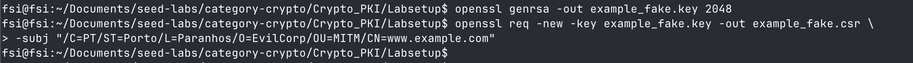

<figcaption><b>Figure 56</b> – Generation of a new RSA private key for the fake <code>www.example.com</code> website.</figcaption>

---

### **2. Creating a Forged Certificate Signing Request (CSR)**

Using the generated private key, we created a Certificate Signing Request (CSR). The Common Name (CN) was deliberately set to **www.example.com**, while the organizational details were falsified.

```bash
openssl req -new -key example_fake.key -out example_fake.csr \
  -subj "/C=PT/ST=Porto/L=Paranhos/O=EvilCorp/OU=MITM/CN=www.example.com"
```


<figcaption><b>Figure 57</b> – Creation of a forged CSR containing malicious organizational details and the victim domain as the Common Name.</figcaption>

---

### **3. Signing the Fake Certificate with the Compromised CA**

With access to the legitimate CA’s private key, we signed the forged CSR. This produced a certificate that would be trusted by any browser that trusts the compromised Root CA.

```bash
openssl x509 -req -in example_fake.csr -CA ca.crt -CAkey ca.key \
  -CAcreateserial -out example_fake.crt -days 365 -sha256 \
  -extfile <(printf "subjectAltName=DNS:www.example.com")
```

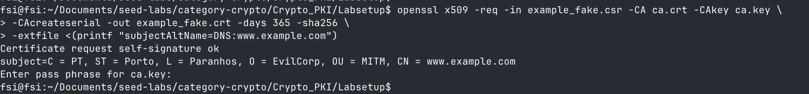

<figcaption><b>Figure 58</b> – Signing the fake certificate using the compromised CA’s private key, including a valid Subject Alternative Name for <code>www.example.com</code>.</figcaption>

---

### **4. Deploying the Malicious Certificate to the Web Server**

The forged certificate and its corresponding private key were copied into the Apache SSL directories inside the attacker-controlled Docker container.

```bash
docker cp example_fake.crt 43c:/etc/ssl/certs/example_fake.crt
docker cp example_fake.key 43c:/etc/ssl/private/example_fake.key
```

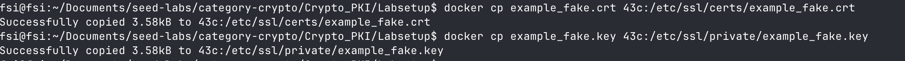

<figcaption><b>Figure 59</b> – Deployment of the malicious certificate and private key to the Apache web server.</figcaption>

---

### **5. Configuring Apache for the MITM Attack**

Apache was configured with a dedicated HTTPS VirtualHost for **www.example.com**, using the forged certificate and a fake document root.

```apache
<VirtualHost *:443>
    ServerName www.example.com
    DocumentRoot /var/www/example
    SSLEngine On
    SSLCertificateFile /etc/ssl/certs/example_fake.crt
    SSLCertificateKeyFile /etc/ssl/private/example_fake.key
</VirtualHost>
```

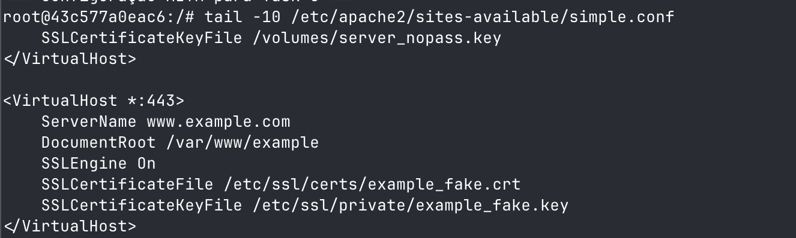

<figcaption><b>Figure 60</b> – Apache VirtualHost configuration enabling the MITM attack using the forged certificate.</figcaption>

---

### **6. Activating the MITM Setup**

After completing the Apache configuration, the web server was restarted to activate the MITM infrastructure.

```bash
docker exec -it 43c service apache2 restart
```

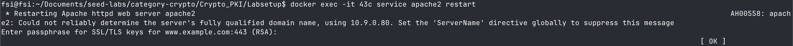

<figcaption><b>Figure 61</b> – Restarting Apache to activate the malicious HTTPS configuration.</figcaption>

---

### **7. Verifying the Successful Attack**

With DNS spoofing already configured via `/etc/hosts`, redirecting **www.example.com** to the attacker’s server, we accessed the website using a browser.

The browser established a secure HTTPS connection **without any warnings**, and the malicious content was displayed.

```text
# Fake example.com - MITM
```

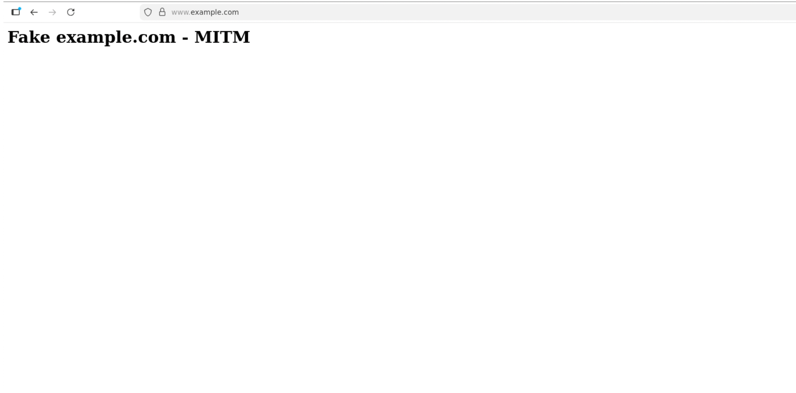

<figcaption><b>Figure 62</b> – Successful MITM attack. The fake website is served over HTTPS with no browser security warnings.</figcaption>

---

### **Analysis and Conclusions**

This task demonstrates the complete failure of the Public Key Infrastructure (PKI) model when a Certificate Authority is compromised.

* **Undetectable Impersonation:**  
  Possession of the CA’s private key allows attackers to generate certificates for any domain, indistinguishable from legitimate ones.

* **Browser Trust Maintained:**  
  The browser trusted the malicious certificate because it was signed by a trusted Root CA.

* **Contrast with Task 5:**  
  In Task 5, PKI successfully blocked the MITM attack due to a certificate hostname mismatch. In this task, PKI provided no protection.

* **Critical Security Implication:**  
  A compromised CA undermines the security of all domains it certifies, enabling large-scale and undetectable MITM attacks.

**Key Takeaway:**  
PKI is highly effective against standard MITM attacks, but its entire trust model collapses if a Root CA is compromised, highlighting the critical importance of CA private key protection.
