# **LOGBOOK 13 – Packet Sniffing and Spoofing Lab**

This logbook documents the experiments performed in the **SEED Packet Sniffing and Spoofing Lab**.  
The objective of this lab is to understand how packet sniffing and packet spoofing work at the network level, using raw sockets, Scapy, and Wireshark, and to analyze how improper network protections can allow an attacker to observe or manipulate network traffic.

All experiments were conducted inside a controlled Docker-based environment provided by the SEED Labs framework.

---

## **Environment Setup**

### **Objective**

The objective of this setup phase is to create a controlled virtual network environment containing multiple hosts and an attacker machine. This environment allows the observation, interception, and manipulation of network traffic in a realistic but isolated setting.

The lab environment consists of three Docker containers connected to the same subnet:

- **Host A** – a normal user host
- **Host B** – another normal user host
- **Attacker** – a privileged container capable of packet sniffing and spoofing

---

### **Container Deployment**

The lab environment was initialized using the provided `docker-compose.yml` file located in the `Labsetup-arm` directory.

The following commands were executed to validate the Docker configuration and launch the containers:

```bash
docker compose config --services
docker compose up -d
docker ps
```

These commands verified the defined services and started all containers in detached mode.

**Screenshot:**
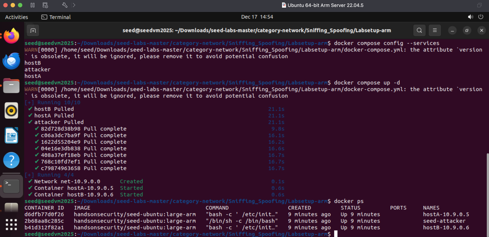

**Figure 1** – Docker containers successfully created and running (`hostA`, `hostB`, and `attacker`).

The output confirms that all three containers were running correctly and ready for interaction.

---

### **Network Configuration**

After starting the containers, the Docker networks were inspected using:

```bash
docker network ls
```

**Screenshot:**
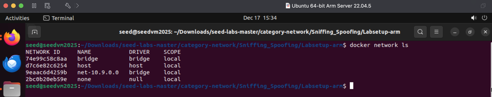

**Figure 2** – Docker network list showing the custom bridge network `net-10.9.0.0`.

The output shows a custom bridge network named `net-10.9.0.0`, which corresponds to the subnet used by the lab environment. This network isolates the containers and enables controlled communication between them.

---

### **Interface Verification**

To identify the network interface associated with the Docker bridge, the following command was executed on the host VM:

```bash
ifconfig
```

**Screenshot:**
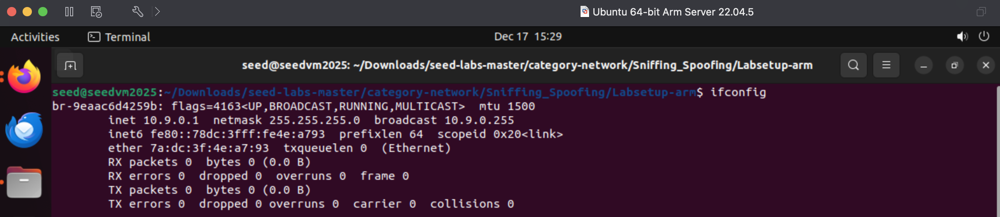

**Figure 3** – Network interface `br-9eaacd4259b` associated with subnet `10.9.0.0/24`.

The interface `br-9eaacd4259b` was assigned the IP address `10.9.0.1`, acting as the gateway for the container network.
This interface is later used in packet sniffing experiments, as it carries all traffic exchanged between the containers.

---

### **Container Access Verification**

To confirm that the containers were accessible and interactive, a shell session was opened inside **Host A** using:

```bash
docker exec -it hostA-10.9.0.5 bash
```

The session was exited immediately after confirming access.

**Screenshot:**
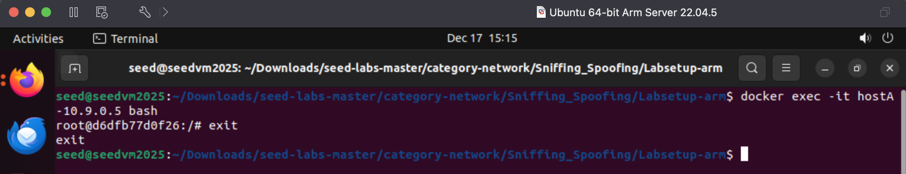

**Figure 4** – Successful interactive shell session inside Host A container.

This confirms that the containers were correctly deployed and ready for use in subsequent packet sniffing and spoofing tasks.

---

### **Summary**

At the end of the setup phase:

* All containers were running successfully
* A custom Docker bridge network (`10.9.0.0/24`) was created
* The bridge interface was identified for packet capture
* Interactive access to containers was confirmed

This environment provides a realistic and isolated platform for experimenting with packet sniffing, spoofing, and traffic analysis in the following tasks.

---

## **Task 1.1 A – Sniffing Packets**

### **Objective**

The objective of Task 1.1 A is to observe ICMP traffic exchanged between two hosts located on the same subnet using a packet sniffer implemented with **Scapy**.
This task demonstrates how an attacker with sufficient privileges can capture and inspect network packets traversing a shared network interface.

---

### **Sniffer Preparation**

The provided `sniffer.py` script was used to capture packets at the Ethernet level.
Before execution, execution permissions were granted to the script:

```bash
chmod a+x sniffer.py
```

The sniffer was then executed with root privileges, which are required to open raw sockets:

```bash
sudo ./sniffer.py
```

**Screenshot:**
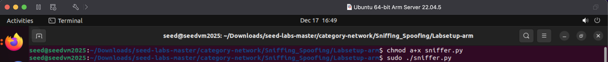

**Figure 5** – Granting execution permissions and running the sniffer with root privileges.

---

### **ICMP Traffic Generation**

To generate observable traffic, ICMP echo requests were sent between **Host A** and **Host B**.

From **Host A** (`10.9.0.5`) to **Host B** (`10.9.0.6`):

```bash
docker exec -it hostA-10.9.0.5 ping -c 2 10.9.0.6
```

**Screenshot:**
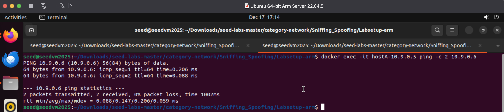

**Figure 6** – ICMP echo requests sent from Host A to Host B.

From **Host B** to **Host A**:

```bash
docker exec -it hostB-10.9.0.6 ping -c 2 10.9.0.5
```

**Screenshot:**
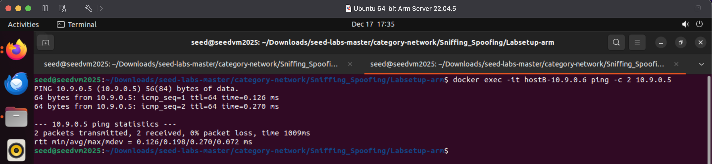

**Figure 7** – ICMP echo requests sent from Host B to Host A.

---

### **Sniffer Configuration**

The sniffer was configured to listen on the Docker bridge interface (`br-9eaacd4259b`) and filter ICMP packets only.

The contents of `sniffer.py` are shown below:

```python
#!/usr/bin/env python3
from scapy.all import *

def print_pkt(pkt):
    pkt.show()

pkt = sniff(iface='br-9eaacd4259b', filter='icmp', prn=print_pkt)
```

**Screenshot:**
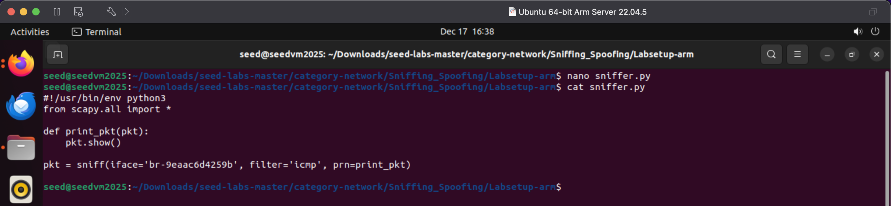

**Figure 8** – ICMP sniffer implemented using Scapy.

---

### **Packet Capture Results**

While the sniffer was running, ICMP packets exchanged between Host A and Host B were successfully captured and displayed.

Captured packets from **Host A → Host B**:

**Screenshot:**
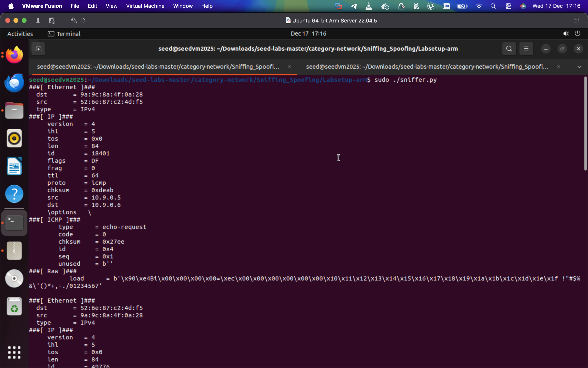

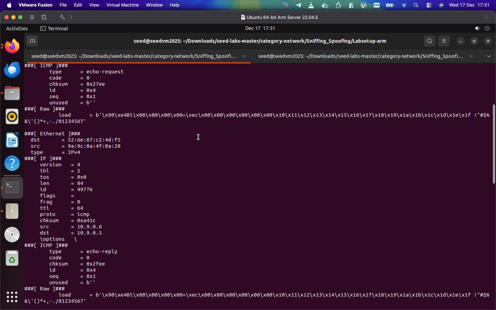

**Figure 9–10** – ICMP echo request and reply packets captured from Host A to Host B.

Captured packets from **Host B → Host A**:

**Screenshot:**


**Figure 11–12** – ICMP echo request and reply packets captured from Host B to Host A.

The captured output includes full Ethernet, IP, and ICMP headers, confirming that the sniffer operates at the raw packet level.

---

### **Analysis of Sniffed Packet Layers**

The packets captured by the sniffer clearly illustrate the layered structure of network communication. Each sniffed packet is composed of multiple protocol layers, encapsulated within one another.

**Ethernet Layer**

The outermost layer of the captured packets is the Ethernet header. This layer contains the source and destination MAC addresses, which are used for communication within the local network. The Ethernet type field indicates that the payload carries an IPv4 packet. This layer is responsible for frame delivery over the local network segment.

**IP Layer**

Encapsulated within the Ethernet frame is the IP (Internet Protocol) layer. The IP header includes the source and destination IP addresses (e.g., `10.9.0.5` and `10.9.0.6`), the protocol field indicating ICMP, and the Time-To-Live (TTL) value. The IP layer provides logical addressing and routing functionality, enabling packets to be delivered between hosts.

**ICMP Layer**

Inside the IP packet is the ICMP (Internet Control Message Protocol) layer. The captured packets show both ICMP echo-request and echo-reply messages, corresponding to the `ping` commands executed between the hosts. The ICMP header contains fields such as type, code, identifier, and sequence number, which are used for network diagnostics and reachability testing.

**Raw Payload**

Following the ICMP header, a raw data payload is present. This payload contains arbitrary bytes sent as part of the ICMP message and has no specific semantic meaning for routing. It simply demonstrates that higher-level data can be encapsulated within protocol headers.

**Encapsulation Summary**

Overall, the captured packets follow the encapsulation order:

```
Ethernet → IP → ICMP → Raw Data
```

This layered structure demonstrates how data is progressively wrapped by different protocol headers as it moves down the network stack for transmission, and how a packet sniffer operating at the raw socket level can inspect all these layers simultaneously.

---

### **Privilege Requirement Verification**

To verify that raw packet sniffing requires elevated privileges, the sniffer was executed **without** `sudo`:

```bash
./sniffer.py
```

This resulted in a permission error, confirming that raw sockets are restricted to privileged users.

**Screenshot:**
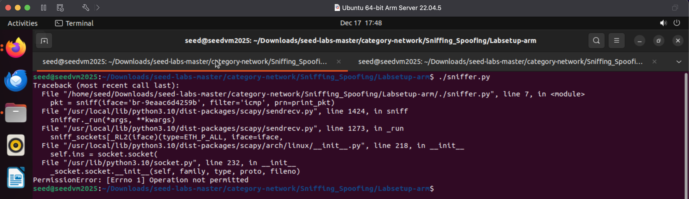

**Figure 13** – Sniffer execution without root privileges fails due to insufficient permissions.

---

### **Summary**

In Task 1.1 A:

* ICMP traffic between two hosts on the same subnet was successfully generated
* A Scapy-based sniffer captured packets on the Docker bridge interface
* Full packet headers were inspected in real time
* Root privileges were confirmed as mandatory for raw packet sniffing

This task demonstrates how an attacker on the same network can passively observe traffic if proper isolation and protections are not enforced.

---

## **Task 1.1 B – Packet Sniffing with BPF Filters**

### **Objective**

The objective of Task 1.1B is to explore the **Berkeley Packet Filter (BPF) syntax** and demonstrate how packet capture can be restricted based on protocol, IP addresses, port numbers, and subnets.

This task also requires identifying the **commands needed to generate the desired packets**, validating that each BPF filter works as intended.

---

### **BPF Filter 1 – Capturing Only ICMP Packets**

The first filter captures **only ICMP packets**.

This filter was already demonstrated in **Task 1.1A**, where the sniffer was configured as:

```python
pkt = sniff(iface='br-9eaacd4259b', filter='icmp', prn=print_pkt)
```

ICMP traffic was generated using `ping` between Host A and Host B.

**Screenshot (reused from Task 1.1A):**


**Figure 14** – ICMP echo-request and echo-reply packets captured using the `icmp` BPF filter.

This confirms that the `icmp` filter restricts packet capture strictly to ICMP traffic.

---

### **BPF Filter 2 – Capturing TCP Packets from a Specific Host and Destination Port**

The second filter captures **TCP packets originating from a specific IP address and destined to port 23 (Telnet)**.

The sniffer was configured with the following BPF filter:

```python
pkt = sniff(
    iface='br-9eaacd4259b',
    filter='tcp and src host 10.9.0.5 and dst port 23',
    prn=print_pkt
)
```

This filter combines multiple BPF conditions:

* `tcp` → capture only TCP packets
* `src host 10.9.0.5` → packets sent by Host A
* `dst port 23` → packets destined to the Telnet port

**Screenshot:**
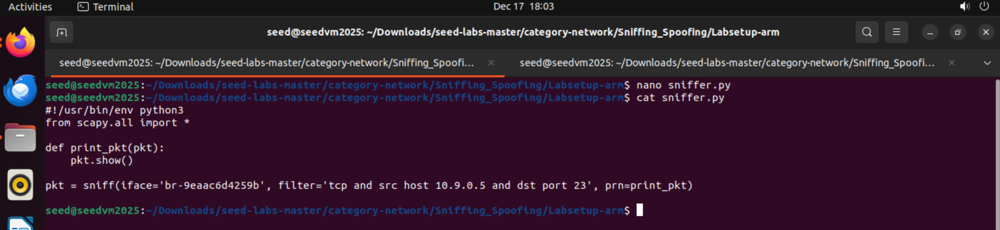

**Figure 15** – Sniffer configured with TCP source host and destination port filter.

To generate matching traffic, a TCP connection attempt was initiated from **Host A** using:

```bash
docker exec -it hostA-10.9.0.5 bash -c "echo hello > /dev/tcp/10.9.0.6/23"
```

**Screenshot:**
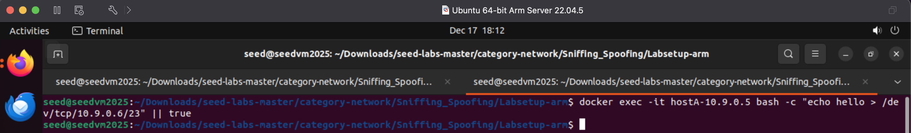

**Figure 16** – TCP traffic sent from Host A to port 23 on Host B.

The sniffer successfully captured the corresponding TCP packets, including payload data:

**Screenshot:**
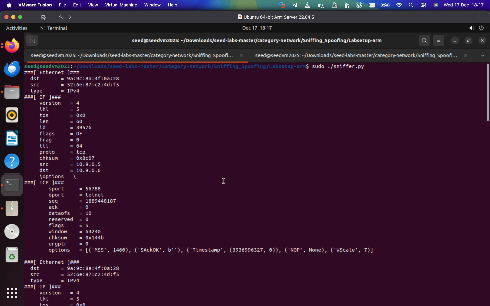

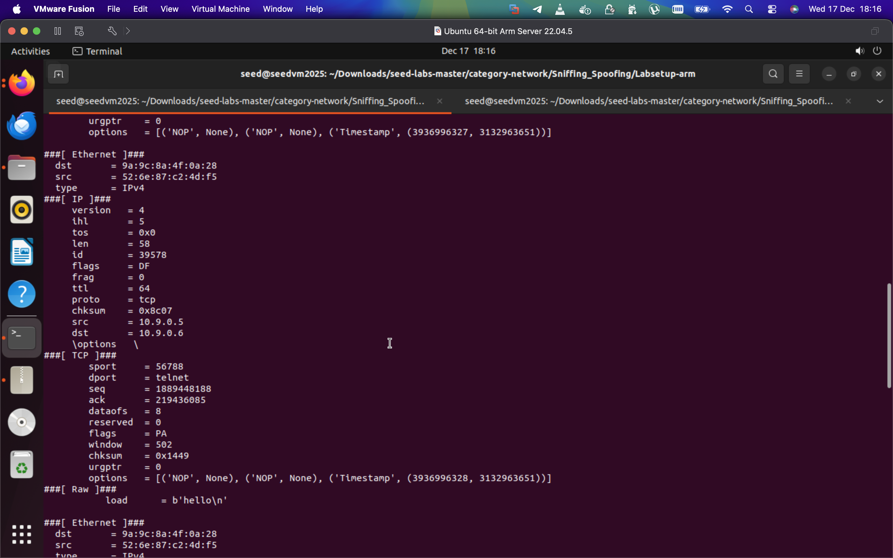

**Figure 17–18** – TCP packets captured using the BPF filter, including application payload (`hello`).

---

### **BPF Filter 3 – Capturing Packets from or to an External Subnet**

The final filter captures packets **originating from or destined to a subnet different from the VM’s local network**, as required by the guide.

The selected subnet was:

```
128.230.0.0/16
```

The sniffer was configured with the following BPF filter:

```python
pkt = sniff(
    iface='ens160',
    filter='net 128.230.0.0/16',
    prn=print_pkt
)
```

**Screenshot:**
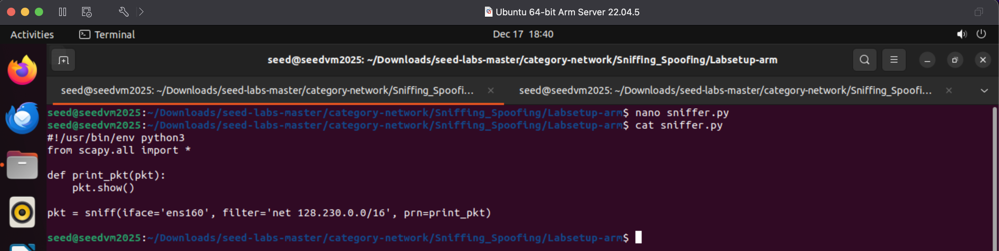

**Figure 19** – Sniffer configured to capture traffic to or from subnet `128.230.0.0/16`.

To generate matching traffic, an ICMP echo request was sent to a host within the selected subnet:

```bash
ping -c 1 -W 1 128.230.0.1
```

**Screenshot:**
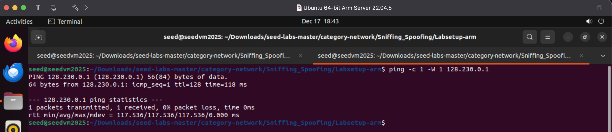

**Figure 20** – ICMP echo request sent to an external subnet host.

The sniffer captured packets matching the subnet filter:

**Screenshot:**
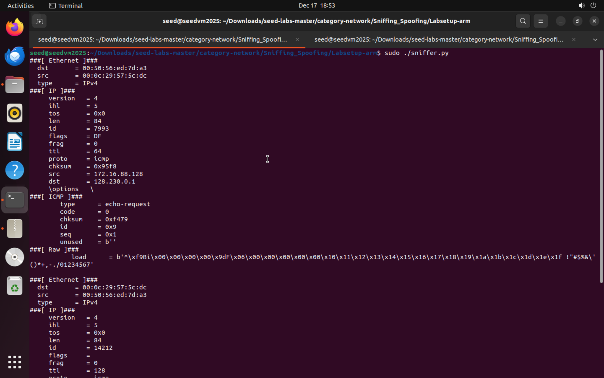

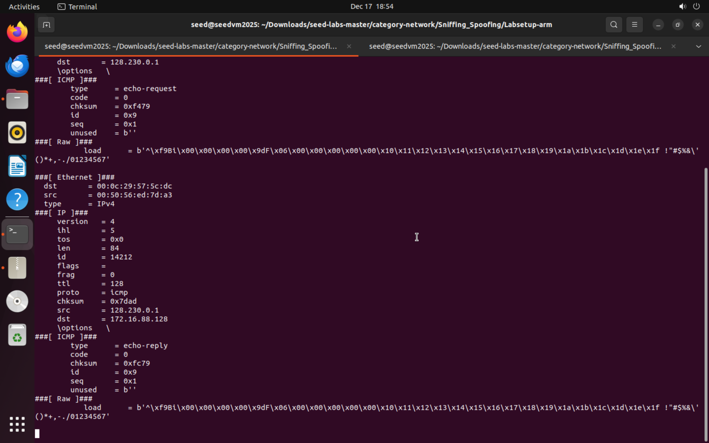

**Figure 21–22** – Packets captured using the `net 128.230.0.0/16` BPF filter.

---

### **Summary**

In Task 1.1B:

* BPF syntax was used to selectively filter packets by protocol, IP address, port, and subnet
* ICMP-only filtering was demonstrated using the `icmp` keyword
* TCP traffic from a specific host and destination port was captured using compound BPF conditions
* Traffic to and from an external subnet was captured using the `net` keyword
* Appropriate commands were executed to generate traffic matching each filter

This task demonstrates how BPF filters provide fine-grained control over packet sniffing, allowing precise inspection of specific network traffic patterns.

---

## **Task 1.2 – Packet Spoofing with ICMP**

### **Objective**

The objective of Task 1.2 is to demonstrate **packet spoofing** by crafting and sending a **forged ICMP packet** using **Scapy**, and to **verify its presence using Wireshark**.

This task highlights how an attacker can manipulate packet headers (such as the source IP address) and inject packets into the network.
Additionally, this task confirms that **Wireshark must be executed with root privileges** in order to capture raw packets, as explicitly required.

---

### **Launching Wireshark with Root Privileges**

To ensure Wireshark had sufficient permissions to capture packets at the network interface level, it was launched using `sudo`:

```bash
sudo wireshark
```

**Screenshot:**
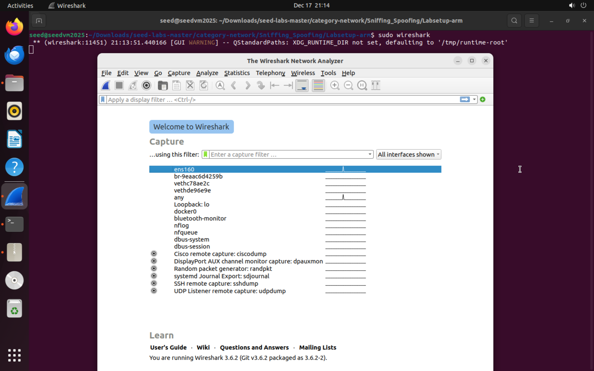

**Figure 23** – Wireshark launched with root privileges.

Running Wireshark without root permissions would prevent access to raw sockets and result in incomplete or failed packet captures. 

---

### **Interface Selection and Capture Filter**

Once Wireshark was running, the Docker bridge interface used by the lab environment was selected:

* **Interface:** `br-9eaacd4259b`
* **Capture filter:** `icmp`

This ensures that only ICMP packets are captured, reducing noise and making spoofed packets easier to identify.

**Screenshot:**
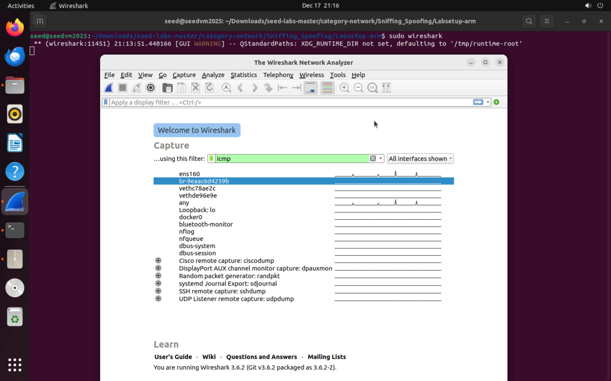

**Figure 24** – Selection of the Docker bridge interface with an ICMP capture filter.

After selecting the interface and filter, packet capture was started.

**Screenshot:**
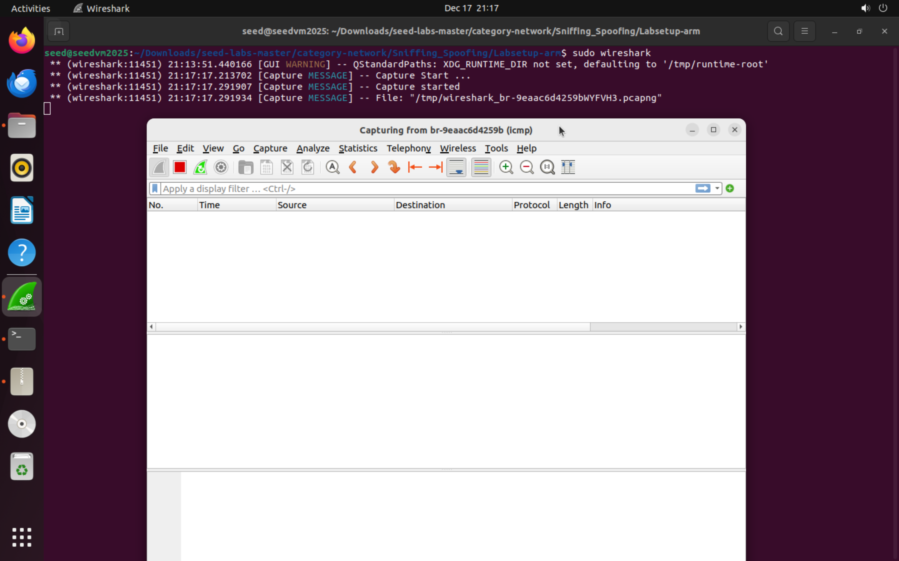

**Figure 25** – Wireshark capturing ICMP packets on the bridge interface.

---

### **ICMP Spoofing Script**

A Python script named `spoof_icmp.py` was created using Scapy to forge an ICMP packet.

The script manually sets a **fake source IP address** (`1.2.3.4`) and sends the packet to **Host B** (`10.9.0.6`):

```python
#!/usr/bin/env python3
from scapy.all import *

ip = IP()
ip.src = "1.2.3.4"
ip.dst = "10.9.0.6"

icmp = ICMP()
pkt = ip/icmp

send(pkt)
```

**Screenshot:**
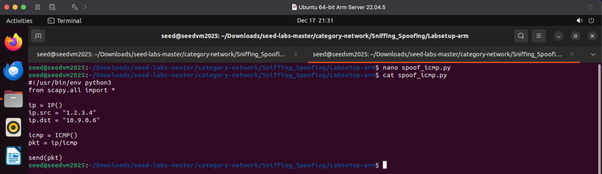

**Figure 26** – ICMP spoofing script implemented using Scapy.

This script demonstrates that Scapy allows full control over packet fields, enabling source IP spoofing.

---

### **Executing the Spoofing Attack**

Before execution, the script was made executable and run with root privileges:

```bash
chmod +x spoof_icmp.py
sudo ./spoof_icmp.py
```

**Screenshot:**
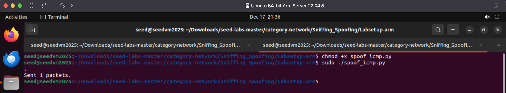

**Figure 27** – Spoofed ICMP packet successfully sent.

The output confirms that **one forged packet** was injected into the network.

---

### **Spoofed Packet Capture and Verification**

While the spoofing script was executed, Wireshark captured the injected packet in real time.

**Screenshot:**
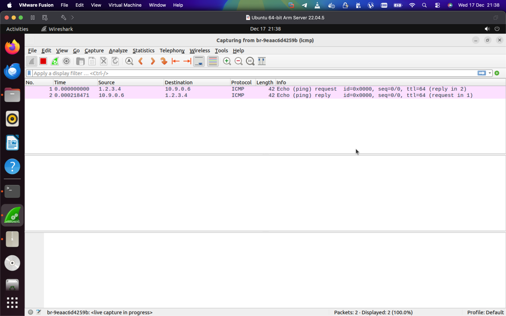

**Figure 28** – Wireshark capture showing the spoofed ICMP packet.

The captured packet clearly shows:

* **Source IP:** `1.2.3.4` (spoofed)
* **Destination IP:** `10.9.0.6`
* **Protocol:** ICMP (Echo request)

This confirms that the packet was **not generated by a legitimate host** in the local subnet, but was instead **crafted and injected by the attacker**.

---

### **Security Implications**

This task demonstrates that:

* IP source addresses can be easily forged when raw packet access is available
* Receivers cannot inherently verify the authenticity of the sender based solely on IP headers
* Network-level protections (such as ingress filtering) are necessary to mitigate spoofing attacks
* Root privileges are required both to **send spoofed packets** and to **capture them using Wireshark**

---

### **Summary**

In Task 1.2:

* Wireshark was executed with root permissions as required
* A forged ICMP packet was created using Scapy
* The source IP address was spoofed successfully
* The injected packet was captured and analyzed using Wireshark

This task clearly demonstrates the feasibility and danger of packet spoofing in improperly protected networks.

---

## **Task 1.3 – Traceroute Using ICMP and TTL Manipulation**

### **Objective**

The objective of Task 1.3 is to understand how **traceroute** works at the network level by manually crafting ICMP packets with increasing **Time-To-Live (TTL)** values.
By sending ICMP Echo Requests to an **external IP address (8.8.8.8)** and observing the ICMP responses, it is possible to identify intermediate routers along the path to the destination.

This task demonstrates how routers decrement the TTL field and generate **ICMP Time Exceeded** messages when the TTL reaches zero.

---

### **Traceroute Script Preparation**

A custom Python script (`traceroute.py`) was created using **Scapy** to send ICMP packets with a configurable TTL value.

The contents of the script are shown below:

```python
#!/usr/bin/env python3
from scapy.all import *
import sys

dst = "8.8.8.8"
ttl = int(sys.argv[1])

ip = IP(dst=dst, ttl=ttl)
icmp = ICMP()
send(ip/icmp, verbose=0)

print(f"Sent ICMP Echo Request to {dst} with TTL={ttl}")
```

**Screenshot:**
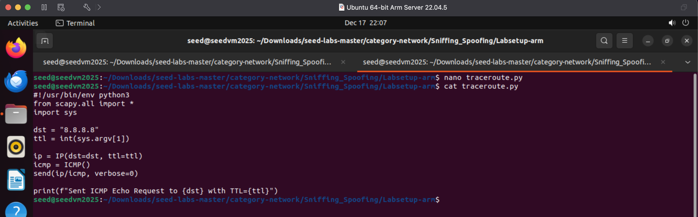

**Figure 29** – Traceroute implementation using ICMP and configurable TTL.

Execution permissions were granted to the script:

```bash
chmod +x traceroute.py
```

---

### **Sending ICMP Packet with TTL = 1**

The traceroute process begins by sending an ICMP Echo Request with **TTL = 1**:

```bash
sudo ./traceroute.py 1
```

**Screenshot:**
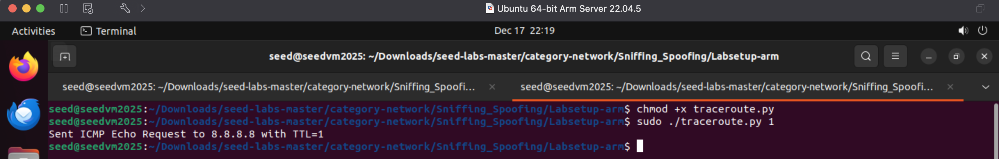

**Figure 30** – ICMP Echo Request sent to 8.8.8.8 with TTL = 1.

---

### **Wireshark Capture (TTL = 1)**

Wireshark was executed with **root privileges**, and a capture was started on interface `ens160` using the capture filter:

```
icmp
```

When the packet with TTL = 1 was sent, Wireshark captured:

* The original ICMP Echo Request
* An **ICMP Time Exceeded** response from the first router on the path

**Screenshot:**
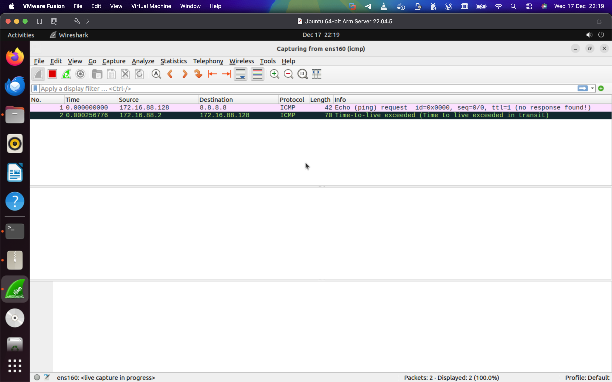

**Figure 31** – ICMP Time Exceeded message generated due to TTL expiration (TTL = 1).

This confirms that the packet reached the first hop and was discarded when the TTL reached zero.

---

### **Sending ICMP Packets with TTL = 2 and TTL = 3**

The traceroute process was continued by increasing the TTL value:

```bash
sudo ./traceroute.py 2
sudo ./traceroute.py 3
```

**Screenshot:**
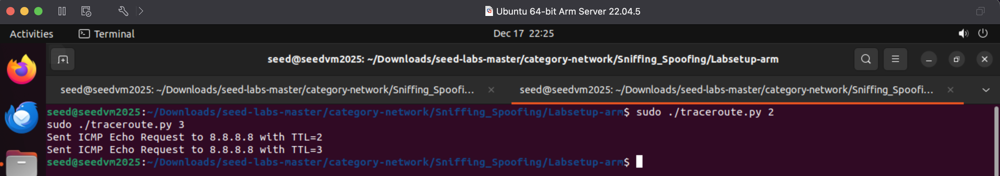

**Figure 32** – ICMP Echo Requests sent with TTL = 2 and TTL = 3.

---

### **Wireshark Capture (TTL = 2 and TTL = 3)**

Wireshark captured additional ICMP responses corresponding to each TTL value:

* For **TTL = 2**, an ICMP Time Exceeded message from the second hop
* For **TTL = 3**, an ICMP Time Exceeded message from the third hop

Each response reveals the IP address of an intermediate router along the path to `8.8.8.8`.

**Screenshot:**
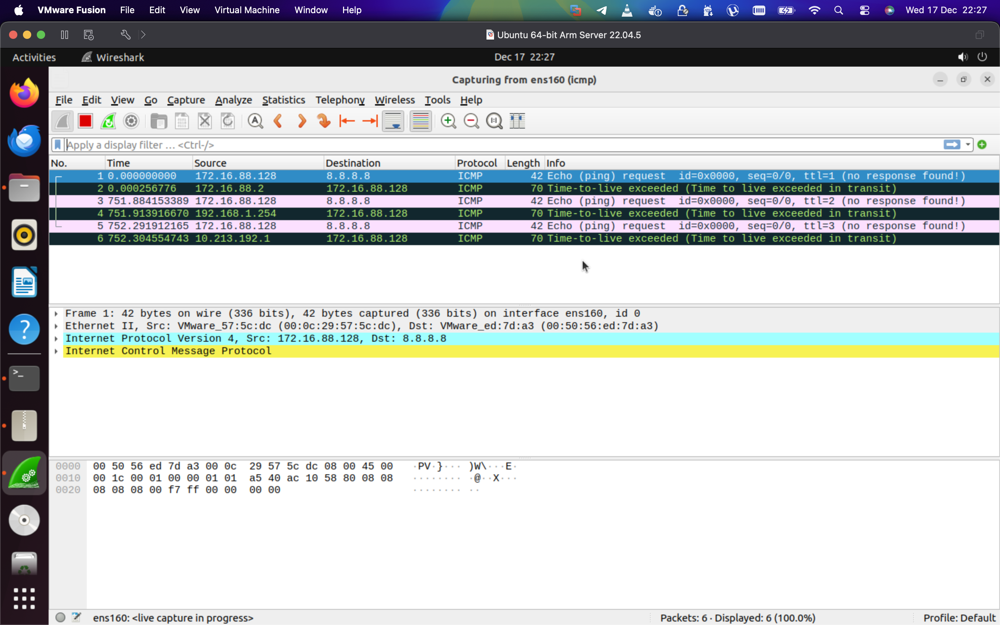

**Figure 33** – ICMP Time Exceeded responses for TTL = 2 and TTL = 3, revealing intermediate hops.

---

### **Analysis**

This experiment clearly demonstrates how traceroute works:

1. The sender transmits ICMP Echo Requests with increasing TTL values
2. Each router decrements the TTL field
3. When TTL reaches zero, the router discards the packet
4. The router responds with an **ICMP Time Exceeded** message
5. The source IP of the ICMP response identifies the router

By gradually increasing TTL, the full network path to the destination can be mapped.

---

### **Summary**

In Task 1.3:

* An external IP address (**8.8.8.8**) was successfully used as the traceroute destination
* ICMP packets with increasing TTL values were generated using Scapy
* Wireshark captured ICMP Time Exceeded messages from intermediate routers
* The internal operation of traceroute was demonstrated and analyzed

This task illustrates how packet sniffing and ICMP behavior can be leveraged to infer network topology and routing paths.

---

## **Task 1.4 – Sniffing and then Spoofing**

### **Objective**

The objective of Task 1.4 is to combine **packet sniffing** and **packet spoofing** techniques to implement a **Man-In-The-Middle (MITM)** attack mechanism.
In this experiment, an attacker-controlled program monitors the network for **ICMP Echo Request** packets and immediately forges corresponding **ICMP Echo Reply** packets.

This causes the victim to believe that a target host is alive and reachable, regardless of whether the host actually exists or responds legitimately.

---

### **Implementation**

To implement the sniff-and-spoof attack, a Python script named `sniff_spoof.py` was created using **Scapy**.
The script operates as follows:

* **Sniffing:**  
  Listens on the Docker bridge interface (`br-2b5c48333e18`) for ICMP packets.

* **Filtering:**  
  Identifies ICMP Echo Request packets (ICMP Type 8).

* **Packet Processing:**  
  Extracts relevant fields from the captured packet, including:
  - Source IP address
  - Destination IP address
  - ICMP Identifier
  - ICMP Sequence Number

* **Spoofing:**  
  Constructs a forged IP packet with the source and destination IP addresses swapped.

* **Replying:**  
  Sends an ICMP Echo Reply (ICMP Type 0) with matching identifier and sequence number so that the victim accepts the reply as valid.

---

### **Sniff-and-Spoof Script**

The full implementation of `sniff_spoof.py` is shown below:

```python
#!/usr/bin/env python3
from scapy.all import *

def spoof_pkt(pkt):
    # Filter for ICMP Echo Requests (Type 8)
    if ICMP in pkt and pkt[ICMP].type == 8:
        print("Original Packet.........")
        print("Source IP: ", pkt[IP].src)
        print("Dest IP: ", pkt[IP].dst)

        # Swap Source and Destination IP addresses
        ip = IP(src=pkt[IP].dst, dst=pkt[IP].src)

        # Construct ICMP Echo Reply (Type 0)
        icmp = ICMP(type=0, id=pkt[ICMP].id, seq=pkt[ICMP].seq)

        # Preserve payload if present
        if Raw in pkt:
            data = pkt[Raw].load
            newpkt = ip / icmp / data
        else:
            newpkt = ip / icmp

        print("Spoofed Packet Sent!\n")
        send(newpkt, verbose=0)

# Sniff packets on the Docker bridge interface
pkt = sniff(iface='br-2b5c48333e18', filter='icmp', prn=spoof_pkt)
```

**Screenshot:**
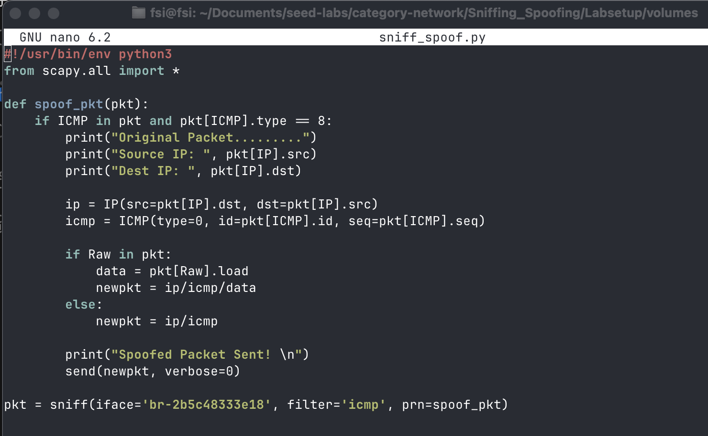

**Figure 34** - Sniff-and-spoof script implemented using Scapy.


---

### **Script Execution**

The script was executed inside the **Attacker** container with root privileges, which are required for raw packet sniffing and injection:

```bash
chmod a+x sniff_spoof.py
sudo ./sniff_spoof.py
```

Once running, the script continuously monitored the network and automatically responded to captured ICMP Echo Requests.

**Screenshot:**
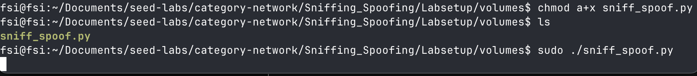

**Figure 35** - Granting execution permissions and running the sniff-and-spoof script with root privileges.

---

### **Experiment Results**

To evaluate the effectiveness of the sniff-and-spoof attack, three different ping scenarios were tested from **Host A (10.9.0.5)**.

**Screenshot:**
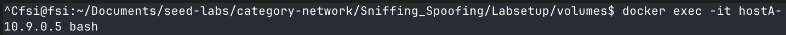

**Figure 36** - Accessing Host A container to perform the ping tests.

---

#### **Scenario 1 – Pinging a Non-Existent Internet Host (1.2.3.4)**

An ICMP Echo Request was sent to IP address `1.2.3.4`, which is not reachable from the local network.

```bash
ping 1.2.3.4
```

**Observation:**  
Host A received valid ICMP Echo Replies with minimal round-trip time.

**Screenshot:**  
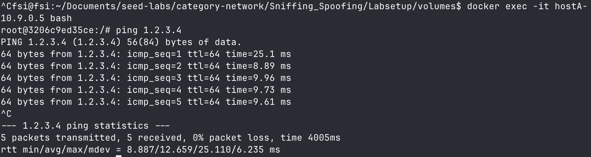
**Figure 37** - Host A receiving valid ping replies from the non-existent IP 1.2.3.4.

**Screenshot:**
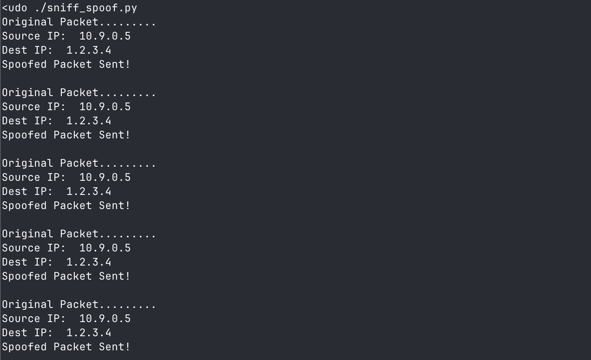

**Figure 38** - Successful ICMP echo replies spoofed by the attacker for destination IP 1.2.3.4.

**Explanation:**  
Since `1.2.3.4` is an external IP address, Host A forwarded the ICMP request to the gateway.
The attacker’s sniffer captured the packet on the bridge interface and immediately injected a spoofed ICMP Echo Reply.
Host A accepted the forged response, believing the host to be alive.

---

#### **Scenario 2 – Pinging a Non-Existent Local Host (10.9.0.99)**

An ICMP Echo Request was sent to `10.9.0.99`, an IP address within the local subnet that does not correspond to any active host.

```bash
ping 10.9.0.99
```

**Observation:**  
The ping command failed with a timeout or *Destination Host Unreachable*, and the sniffing script did not capture any packets.

**Screenshot:**
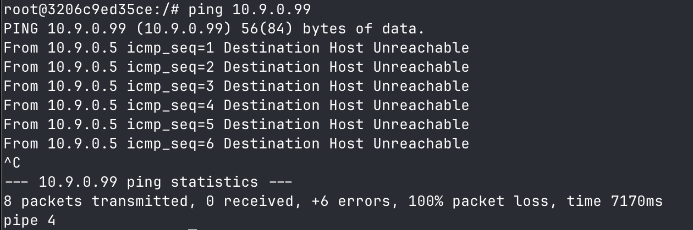

**Figure 39** - Ping attempt to non-existent local host 10.9.0.99 resulting in failure due to ARP resolution.

**Explanation:**  

This behavior is explained by the **ARP protocol**:

* Before sending an ICMP packet to a local IP, the host must resolve the destination MAC address using ARP
* Host A broadcasts an ARP request asking for the MAC address of `10.9.0.99`
* Since the host does not exist, no ARP reply is received
* Without a MAC address, the ICMP packet is never transmitted
* As a result, the sniffer never sees the packet and cannot spoof a reply

---

#### **Scenario 3 – Pinging a Legitimate Internet Host (8.8.8.8)**

An ICMP Echo Request was sent to `8.8.8.8`, a reachable and active Internet host.

```bash
ping 8.8.8.8
```

**Observation:**  
Host A received replies marked as `(DUP!)`, indicating duplicate responses.

**Screenshot:**
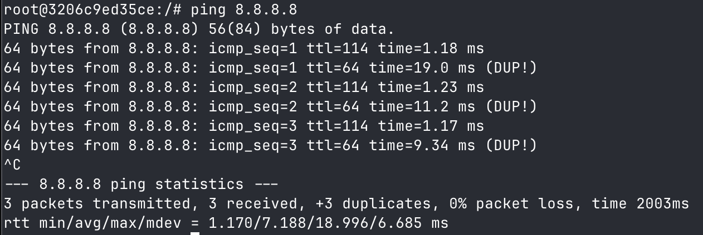

**Figure 40** - Duplicate ICMP echo replies received when pinging 8.8.8.8, indicating spoofed and legitimate responses.

**Screenshot:**
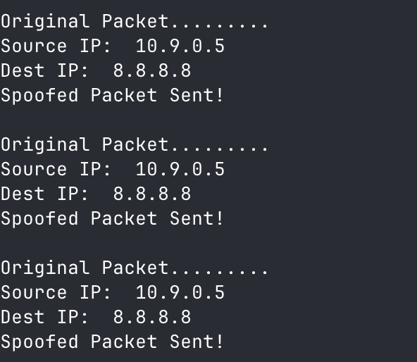

**Figure 41** - Attacker console output showing ICMP packets related to the sniff-and-spoof attack involving destination 8.8.8.8.

**Explanation:**  

This result reveals a **race condition**:

* The real `8.8.8.8` server received the request and sent a legitimate ICMP Echo Reply
* The attacker’s script also sniffed the request and sent a spoofed reply
* Host A received two replies for the same request
* One of the replies was marked as duplicate by the `ping` utility

---

### **Summary**

In Task 1.4:

* A combined packet sniffing and spoofing attack was successfully implemented using Scapy
* The attacker was able to forge ICMP replies for external IP addresses
* The attack failed for non-existent local hosts due to ARP resolution requirements
* Duplicate replies confirmed that spoofed packets can be injected even when the legitimate host is active

This task demonstrates how sniffing and spoofing can be combined to manipulate network behavior, while also highlighting the limitations imposed by lower-layer protocols such as ARP.

